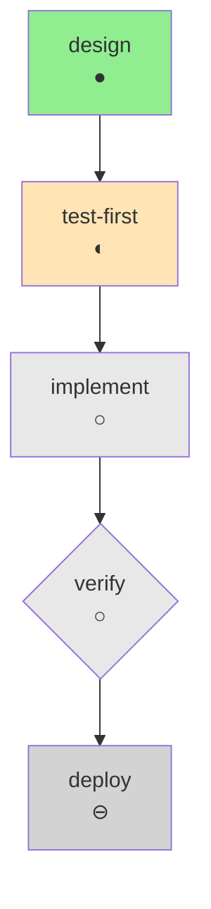

# State Tracking

Formats for visualizing chain progress in conversation.

## Markdown Table (Default)

Primary format for detailed progress:

```markdown
## Chain Progress: api-development

| Step | Skill | Status | Notes |
|------|-------|--------|-------|
| design | api-design-patterns | ● Done | OpenAPI spec created |
| test-first | tdd-workflow | ◐ Active | Writing endpoint tests |
| implement | backend-implementation-patterns | ○ Pending | |
| verify | verification-loop | ○ Pending | |
| deploy | deployment-cicd | ⊖ Optional | |

**Progress**: 2/5 steps (40%)
**Current**: test-first
**Checkpoint**: After verify
```

## Status Icons

| Icon | Status | Meaning |
|------|--------|---------|
| ○ | Pending | Waiting for dependencies |
| ◐ | Active | Currently in progress |
| ● | Done | Successfully completed |
| ⊖ | Optional | Available but not required |
| ⊘ | Skipped | Explicitly skipped |
| ✕ | Failed | Error occurred |

## Compact Progress Bar

For quick status checks:

```
api-development [████████░░░░░░░░░░░░] 40%
                 ●●◐○○
```

Legend:
```
● = complete
◐ = active
○ = pending
```

## ASCII Art Progress

Visual step-by-step display:

```
Chain: api-development

[●] design ─────────┐
    api-design-patterns
    "OpenAPI spec created"
                    │
[◐] test-first ◄────┘
    tdd-workflow
    "Writing endpoint tests"
                    │
[ ] implement ◄─────┘
    backend-implementation-patterns
                    │
[ ] verify ◄────────┘ ← checkpoint
    verification-loop
                    │
[○] deploy ◄────────┘ (optional)
    deployment-cicd
```

## Dependency Graph

For chains with parallel paths:

```
Chain: fullstack-feature

        ┌─────────────┐
        │ requirements│ ●
        └──────┬──────┘
               │
        ┌──────▼──────┐
        │     api     │ ●
        └──────┬──────┘
               │
     ┌─────────┴─────────┐
     │                   │
┌────▼────┐       ┌──────▼──────┐
│ backend │ ◐     │  frontend   │ ○
└────┬────┘       └──────┬──────┘
     │                   │
     └─────────┬─────────┘
               │
        ┌──────▼──────┐
        │   testing   │ ○
        └──────┬──────┘
               │
        ┌──────▼──────┐
        │   verify    │ ○  ← checkpoint
        └─────────────┘
```

## Progress Summary Formats

### Minimal

```
api-development: 2/5 (40%) — test-first
```

### Standard

```
Chain: api-development
Progress: 2/5 steps (40%)
Current: test-first (tdd-workflow)
Next: implement
Checkpoint: After verify
```

### Detailed

```markdown
## Chain: api-development
*Full API development from design to deployment*

### Progress: 40% (2/5 steps)

| # | Step | Status |
|---|------|--------|
| 1 | design | ● Complete |
| 2 | test-first | ◐ Active |
| 3 | implement | ○ Pending |
| 4 | verify | ○ Pending (checkpoint) |
| 5 | deploy | ⊖ Optional |

### Current Step
**test-first** using `tdd-workflow`
Writing tests for endpoints defined in OpenAPI spec

### Artifacts Created
- `openapi.yaml` — API contract (14 endpoints)
- `docs/api.md` — Endpoint documentation

### Next Steps
1. Complete test-first (current)
2. Implement endpoints
3. **Checkpoint** for verification review
4. Deploy (optional)
```

## Mermaid Diagram

For rendered documentation:



## State in Conversation

Track state using markdown blocks:

```markdown
<!-- CHAIN_STATE
chain: api-development
current_step: test-first
completed: [design]
pending: [implement, verify, deploy]
checkpoint_after: verify
started_at: conversation turn 3
-->
```

Claude parses this to maintain context across turns.

## Status Command Output

When user runs `/skill-chain-prompts status`:

```markdown
## Chain Status

**Chain**: api-development
**Description**: Full API development from design to deployment
**Started**: Turn 3
**Mode**: Sequential
**On Failure**: Pause

### Progress

| Step | Skill | Status | Duration | Artifacts |
|------|-------|--------|----------|-----------|
| design | api-design-patterns | ● Done | ~5 turns | openapi.yaml, api.md |
| test-first | tdd-workflow | ◐ Active | ongoing | tests/ (partial) |
| implement | backend-implementation-patterns | ○ Pending | - | - |
| verify | verification-loop | ○ Pending | - | - |
| deploy | deployment-cicd | ⊖ Optional | - | - |

**Overall**: 40% complete (2/5 steps)
**Current**: test-first
**ETA**: ~3 more steps to checkpoint
```

## Tips

1. **Use tables for detailed tracking** — Most information-dense
2. **Use progress bars for quick checks** — Visual at a glance
3. **Use graphs for complex dependencies** — Shows parallel paths
4. **Update state after each step** — Keep tracking current
5. **Include artifact lists** — Shows tangible progress
