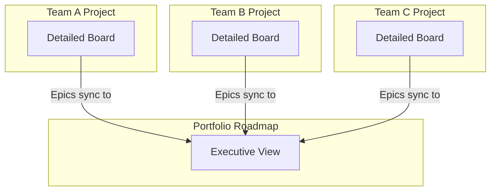
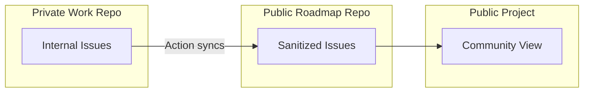
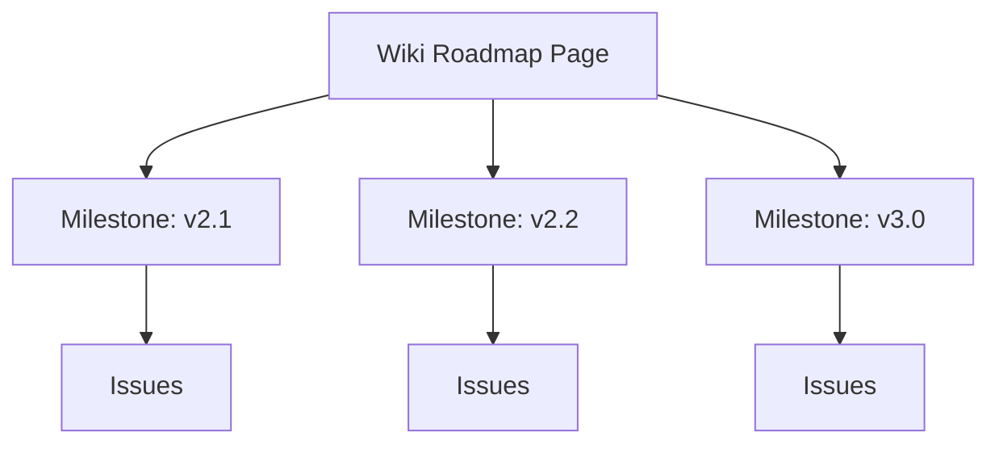

# Roadmap Case Studies

Real-world examples of GitHub roadmap implementations from major open source projects.

## Case Study 1: GitHub's Public Roadmap

**Project:** github/roadmap
**URL:** https://github.com/github/roadmap

### Architecture

```
┌─────────────────────────────────────────────────────────────┐
│                    github/roadmap                            │
├─────────────────────────────────────────────────────────────┤
│  Repository Type: Public (dedicated roadmap repo)           │
│  Issue Source: Same repo (not linked to code repos)         │
│  Project Board: Organization-level Project V2               │
│  Visibility: Fully public                                   │
└─────────────────────────────────────────────────────────────┘
```

### Key Characteristics

1. **Dedicated Repository**
   - Roadmap items are issues in a standalone repo
   - Separates roadmap from code repositories
   - Allows focused discussion without code noise

2. **Strict Issue Locking**
   - Issues are locked to prevent the roadmap becoming a help desk
   - Feedback directed to GitHub Discussions instead
   - Prevents roadmap items from becoming feature request threads

3. **Label Taxonomy**
   ```
   shipping-to-server    # GitHub Enterprise Server
   shipping-to-cloud     # GitHub.com
   beta                  # Pre-release
   ga                    # General Availability
   exploring             # Under consideration
   ```

4. **Quarter-Based Columns**
   - Q1, Q2, Q3, Q4 columns
   - "Future" for items beyond current year
   - "Shipped" for completed items

### Lessons for Your Projects

- **Dedicated repo works well** for organizations with multiple product repos
- **Lock issues** if you can't staff moderation
- **Shipping labels** help users understand availability timeline
- **Forward-looking statement** disclaimer required for public roadmaps

---

## Case Study 2: VS Code Wiki Roadmap

**Project:** microsoft/vscode
**URL:** https://github.com/microsoft/vscode/wiki/Roadmap

### Architecture

```
┌─────────────────────────────────────────────────────────────┐
│                    microsoft/vscode                          │
├─────────────────────────────────────────────────────────────┤
│  Roadmap Location: Wiki page (not Project board)            │
│  Iteration Plans: Monthly issue manifesto                   │
│  Tracking: GitHub Milestones                                │
│  Visibility: Public                                         │
└─────────────────────────────────────────────────────────────┘
```

### Key Characteristics

1. **Text-Based Vision Document**
   - 12-18 month high-level themes in Wiki
   - Prose format, not Gantt chart
   - Strategic themes: Performance, Accessibility, etc.

2. **Monthly Iteration Plans**
   - Detailed GitHub Issue as monthly plan
   - Checklist format with specific deliverables
   - Example: "January 2024 Iteration Plan"

3. **Milestone-Driven Releases**
   - Each monthly release has a Milestone
   - Issues assigned to milestone for tracking
   - Release notes generated from milestone

4. **High Granularity Near-Term**
   - Current month: Detailed task-level items
   - Next quarter: Feature-level themes
   - 6+ months: Strategic directions only

### Lessons for Your Projects

- **Wiki roadmaps work** for technical audiences who prefer reading
- **Iteration plans as issues** provide accountability
- **Granularity decreases** with time horizon
- **Best for teams** with consistent release cadence

---

## Case Study 3: React Native Community Roadmap

**Project:** facebook/react-native
**URL:** https://github.com/facebook/react-native/wiki/Roadmap

### Architecture

```
┌─────────────────────────────────────────────────────────────┐
│                   facebook/react-native                      │
├─────────────────────────────────────────────────────────────┤
│  Roadmap Type: Wiki + Blog announcements                    │
│  Focus: Architecture health + Community trust               │
│  Communication: Regular status blog posts                   │
│  Visibility: Public                                         │
└─────────────────────────────────────────────────────────────┘
```

### Key Characteristics

1. **Health-Focused Roadmap**
   - Explicit "Repository Health" section
   - "Stable APIs" as roadmap items
   - Technical debt acknowledged publicly

2. **Transparency About Delays**
   - Blog posts explain *why* things are delayed
   - "New Architecture" multi-year journey documented
   - Trust built through honest communication

3. **Community-Driven Priorities**
   - RFC process for major changes
   - Community feedback integrated
   - Roadmap reflects community needs, not just Meta's

4. **Minimal Gantt, Maximum Context**
   - No specific date promises
   - Theme-based organization
   - Progress indicators (Started, In Progress, Completed)

### Lessons for Your Projects

- **Acknowledge technical debt** publicly builds trust
- **Explain delays** rather than silent slips
- **Community input** makes roadmap more credible
- **Health metrics** can be roadmap items themselves

---

## Comparative Analysis

| Aspect | GitHub | VS Code | React Native |
|--------|--------|---------|--------------|
| **Format** | Project Board | Wiki + Issues | Wiki + Blog |
| **Granularity** | Feature-level | Task-level near-term | Theme-level |
| **Date Commitment** | Quarterly | Monthly | None |
| **Feedback Channel** | Discussions | Issues | RFCs |
| **Issue Locking** | Yes | No | No |
| **Update Frequency** | Continuous | Monthly | Quarterly |

---

## Implementation Patterns

### Pattern 1: Hub-and-Spoke (Enterprise)



**Best for:** Large organizations with multiple teams
**Implementation:** Cross-project synchronization via Actions

### Pattern 2: Shadow Items (Public OSS)



**Best for:** Companies with proprietary code but public roadmap
**Implementation:** GitHub Action mirrors selected issues

### Pattern 3: Wiki + Milestones (Small Team)



**Best for:** Small teams with predictable release cycles
**Implementation:** Manual wiki + native GitHub Milestones

---

## Metrics from Case Studies

### GitHub's Approach

- **Say/Do Ratio:** Not publicly disclosed
- **Shipped Items:** Visible in "Shipped" column
- **Community Signal:** Discussion reactions on items

### VS Code's Approach

- **Iteration Completion:** Checklist % in monthly issue
- **Release Cadence:** Monthly (highly predictable)
- **Issue Throughput:** Visible in milestone progress

### React Native's Approach

- **Architecture Migration:** Progress percentage shared
- **Breaking Changes:** Documented in advance
- **Community Health:** Issue response time improving

---

## Applying Case Studies

### For Startups (Seed - Series B)

Follow a simplified GitHub model:
- Single Project board
- Quarterly columns
- No need for shadow items (likely all public)

### For Growth Stage (Series B - D)

Adopt VS Code patterns:
- Iteration plans as issues
- Milestone tracking
- More granular near-term planning

### For Enterprise / Public Companies

Full GitHub model:
- Dedicated roadmap repository
- Strict governance
- Shadow items for private work
- Forward-looking statement disclaimer

---

## Anti-Patterns Observed

| Project | Anti-Pattern Avoided | How |
|---------|---------------------|-----|
| GitHub | Help desk in issues | Locked issues, Discussions |
| VS Code | Zombie roadmap | Monthly iteration refresh |
| React Native | Silent slips | Blog transparency |

---

## Template: Public Roadmap Disclaimer

From GitHub's roadmap:

> "This roadmap represents our current plans and is subject to change. Items may be added, removed, or reprioritized at any time. The presence of an item on this roadmap does not guarantee it will be shipped. Timing estimates are directional and not commitments."

Include this (or similar) on any public-facing roadmap to manage expectations.
