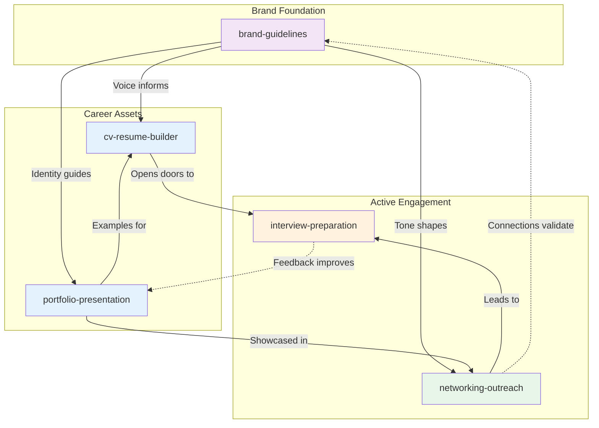
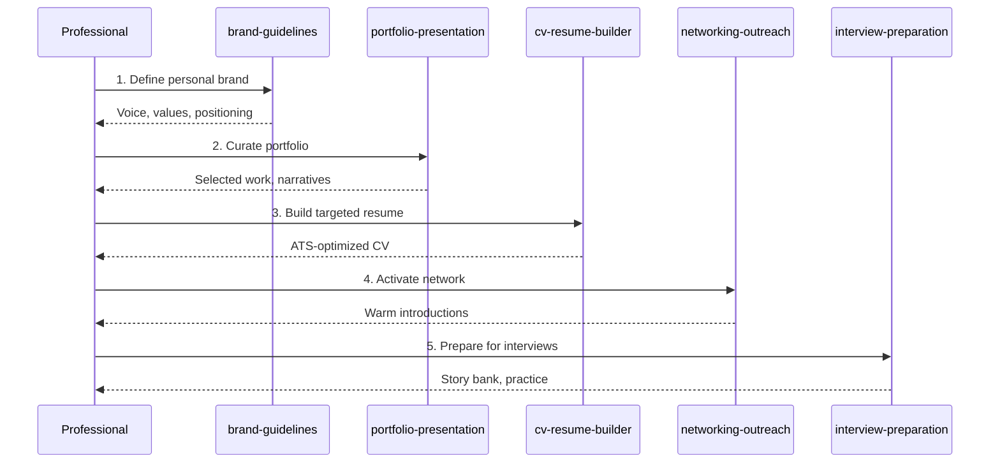
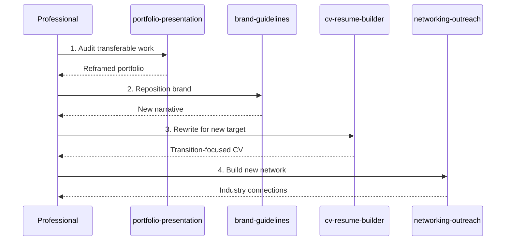
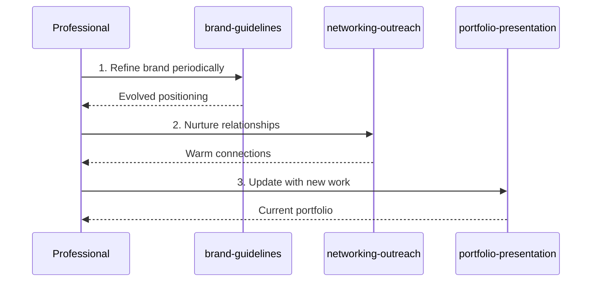
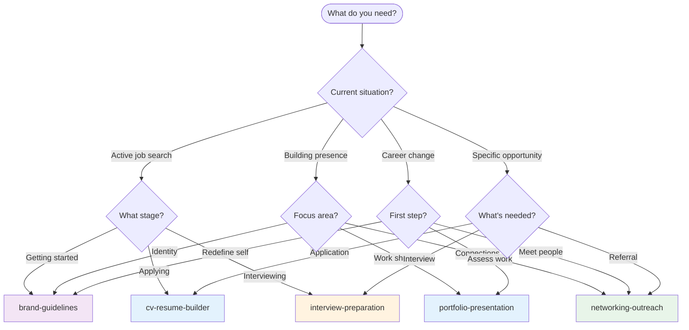
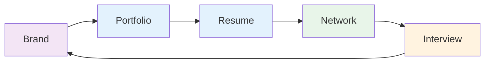

# Professional Career Development Skills Ecosystem

This guide maps the relationships between career development skills in this repository and provides workflow guidance for using them together effectively.

## Skill Overview

| Skill | Category | Focus Area |
|-------|----------|------------|
| [`cv-resume-builder`](../../skills/professional/cv-resume-builder/) | professional | Job application documents |
| [`interview-preparation`](../../skills/professional/interview-preparation/) | professional | Interview readiness and practice |
| [`portfolio-presentation`](../../skills/professional/portfolio-presentation/) | professional | Work curation and showcase |
| [`networking-outreach`](../../skills/professional/networking-outreach/) | professional | Professional relationship building |
| [`brand-guidelines`](../../skills/professional/brand-guidelines/) | professional | Personal brand definition |

## Ecosystem Diagram

## Workflow Scenarios

### Scenario 1: Job Search Campaign

**Goal:** Execute a complete job search from brand to offer.

**Skill Sequence:**
1. **`brand-guidelines`** - Define personal brand and positioning
2. **`portfolio-presentation`** - Curate and present best work
3. **`cv-resume-builder`** - Create targeted resume(s)
4. **`networking-outreach`** - Leverage network for opportunities
5. **`interview-preparation`** - Prepare for interview process

### Scenario 2: Career Transition

**Goal:** Pivot to a new role or industry.

**Skill Sequence:**
1. **`portfolio-presentation`** - Audit and reframe existing work
2. **`brand-guidelines`** - Reposition personal brand for new target
3. **`cv-resume-builder`** - Create transition-focused resume
4. **`networking-outreach`** - Build network in target industry

### Scenario 3: Continuous Presence

**Goal:** Maintain professional visibility without active job search.

**Skill Sequence:**
1. **`brand-guidelines`** - Periodic brand refinement
2. **`networking-outreach`** - Ongoing relationship nurturing
3. **`portfolio-presentation`** - Regular portfolio updates

## Decision Tree: Which Skill to Use?

## Cross-Reference Matrix

This matrix shows when each skill might invoke or reference another:

| Primary Skill | Invokes | For |
|---------------|---------|-----|
| `brand-guidelines` | `cv-resume-builder` | Applying brand voice to resume |
| `brand-guidelines` | `portfolio-presentation` | Consistent portfolio identity |
| `brand-guidelines` | `networking-outreach` | Consistent messaging |
| `cv-resume-builder` | `portfolio-presentation` | Sourcing achievement examples |
| `cv-resume-builder` | `brand-guidelines` | Voice and positioning |
| `portfolio-presentation` | `brand-guidelines` | Visual and verbal identity |
| `portfolio-presentation` | `cv-resume-builder` | Resume-ready summaries |
| `networking-outreach` | `brand-guidelines` | Elevator pitch |
| `networking-outreach` | `portfolio-presentation` | Sharing work examples |
| `interview-preparation` | `portfolio-presentation` | Story examples |
| `interview-preparation` | `cv-resume-builder` | Talking through resume |

## Common Handoff Patterns

### Brand Guidelines → Resume Builder
Brand informs resume voice:
- Tone and language
- Value proposition
- Positioning statements

### Portfolio → Resume
Work samples inform resume:
- Achievement metrics
- Project summaries
- Impact statements

### Resume → Interview
Resume opens interview doors:
- Stories to expand on
- Questions to anticipate
- Gaps to address

### Networking → Interview
Connections lead to opportunities:
- Referral context
- Company intel
- Interview expectations

### Interview → Portfolio
Feedback improves presentation:
- What resonated
- What needs work
- Missing examples

## Best Practices

### Sequential vs. Parallel Usage
- **Sequential:** Job search (brand → portfolio → resume → network → interview)
- **Parallel:** Portfolio + networking can happen simultaneously

### Avoiding Overlap
- **Identity concerns:** `brand-guidelines` owns voice and positioning
- **Document concerns:** `cv-resume-builder` owns application materials
- **Showcase concerns:** `portfolio-presentation` owns work presentation
- **Relationship concerns:** `networking-outreach` owns connection building
- **Performance concerns:** `interview-preparation` owns interview readiness

### When to Combine Skills
Some tasks benefit from multiple skills:
- **Application package:** resume + portfolio + brand
- **Active search:** all skills in orchestration
- **Career change:** portfolio audit + brand refresh + new resume

## Cyclical Nature

Career development is cyclical, not linear:

Each interview experience refines your brand, which updates your portfolio, which improves your resume, which strengthens your network, which opens more interviews.

## Related Resources

- [Creating Skills Guide](./creating-skills.md)
- [Skill Specification](../api/skill-spec.md)
- [Getting Started](./getting-started.md)
