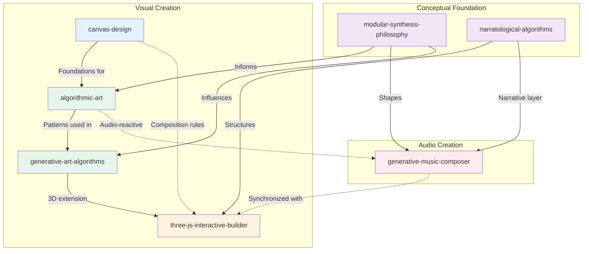
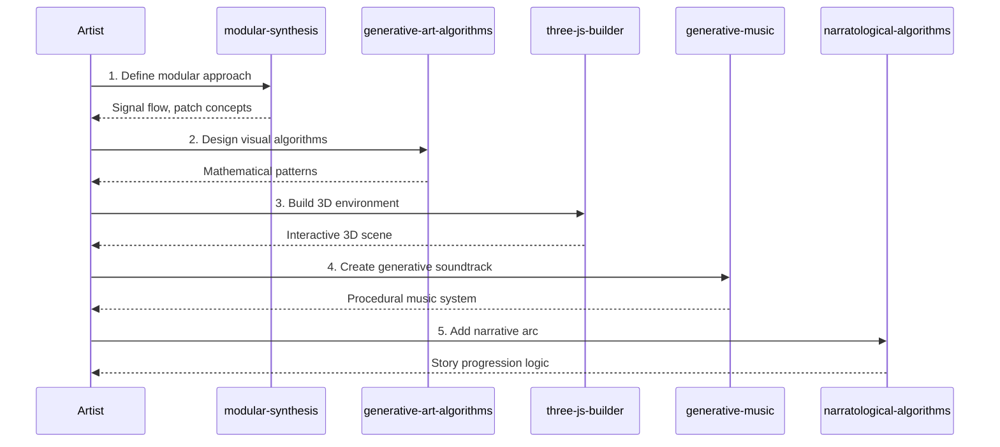
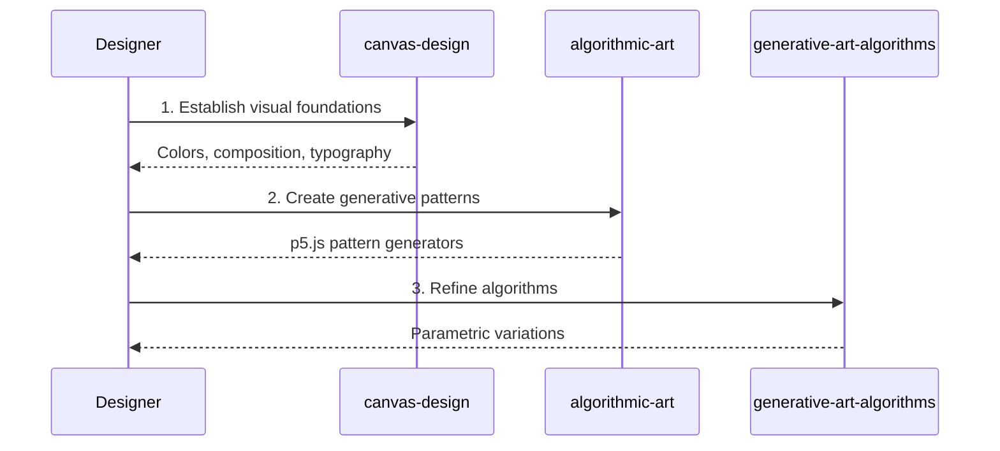
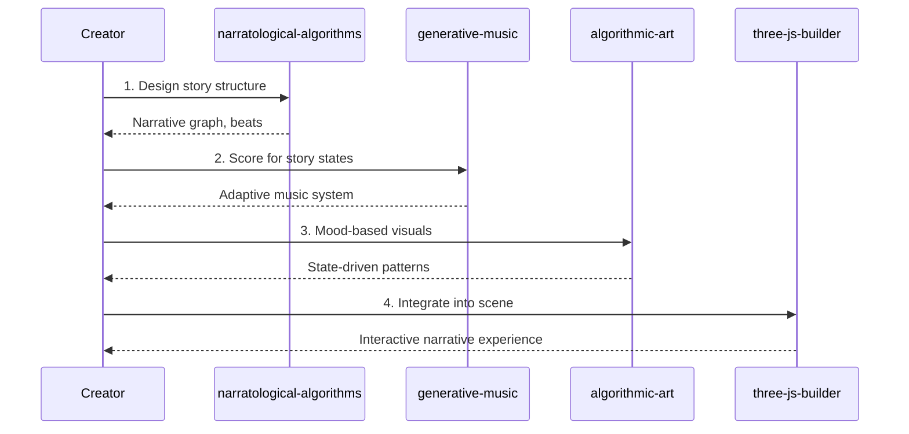
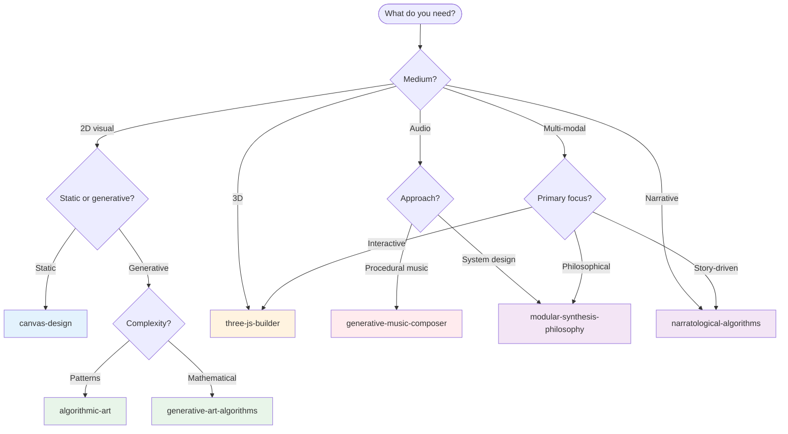

# Creative Coding & Generative Systems Skills Ecosystem

This guide maps the relationships between creative coding and generative systems skills in this repository and provides workflow guidance for using them together effectively.

## Skill Overview

| Skill | Category | Focus Area |
|-------|----------|------------|
| [`algorithmic-art`](../../skills/creative/algorithmic-art/) | creative | p5.js generative art and patterns |
| [`generative-art-algorithms`](../../skills/creative/generative-art-algorithms/) | creative | Mathematical pattern generation |
| [`three-js-interactive-builder`](../../skills/creative/three-js-interactive-builder/) | creative | 3D WebGL visualizations |
| [`generative-music-composer`](../../skills/creative/generative-music-composer/) | creative | Procedural music generation |
| [`modular-synthesis-philosophy`](../../skills/creative/modular-synthesis-philosophy/) | creative | Synthesis as design approach |
| [`canvas-design`](../../skills/creative/canvas-design/) | creative | Static visual design and composition |
| [`narratological-algorithms`](../../skills/creative/narratological-algorithms/) | creative | Story structure formalization |

## Ecosystem Diagram

## Workflow Scenarios

### Scenario 1: Interactive Installation

**Goal:** Create an interactive audiovisual installation with narrative elements.

**Skill Sequence:**
1. **`modular-synthesis-philosophy`** - Establish modular, patchable architecture
2. **`generative-art-algorithms`** - Design underlying visual algorithms
3. **`three-js-interactive-builder`** - Build 3D interactive environment
4. **`generative-music-composer`** - Create synchronized generative audio
5. **`narratological-algorithms`** - Add narrative structure to experience

### Scenario 2: Generative Brand Assets

**Goal:** Create procedurally generated visual assets from design foundations.

**Skill Sequence:**
1. **`canvas-design`** - Establish visual design foundations
2. **`algorithmic-art`** - Create generative pattern systems
3. **`generative-art-algorithms`** - Refine and parameterize

### Scenario 3: Procedural Storytelling

**Goal:** Build an interactive narrative with procedural music and visuals.

**Skill Sequence:**
1. **`narratological-algorithms`** - Design story structure and states
2. **`generative-music-composer`** - Create adaptive soundtrack
3. **`algorithmic-art`** - Design state-responsive visuals
4. **`three-js-interactive-builder`** - Integrate into interactive experience

## Decision Tree: Which Skill to Use?

## Cross-Reference Matrix

This matrix shows when each skill might invoke or reference another:

| Primary Skill | Invokes | For |
|---------------|---------|-----|
| `modular-synthesis-philosophy` | `generative-music-composer` | Audio implementation |
| `modular-synthesis-philosophy` | `algorithmic-art` | Visual signal flow |
| `canvas-design` | `algorithmic-art` | Animating static designs |
| `algorithmic-art` | `canvas-design` | Composition foundations |
| `algorithmic-art` | `generative-art-algorithms` | Mathematical refinement |
| `generative-art-algorithms` | `three-js-interactive-builder` | 3D visualization |
| `three-js-interactive-builder` | `generative-music-composer` | Audio synchronization |
| `three-js-interactive-builder` | `narratological-algorithms` | Story progression |
| `generative-music-composer` | `modular-synthesis-philosophy` | System architecture |
| `narratological-algorithms` | `generative-music-composer` | Narrative pacing |
| `narratological-algorithms` | `three-js-interactive-builder` | Interactive narrative |

## Common Handoff Patterns

### Modular Synthesis → Generative Art/Music
Philosophy informs implementation:
- Signal flow concepts apply to visual data
- Patch-based thinking for modular systems
- Feedback loops and state machines

### Canvas Design → Algorithmic Art
Static design becomes generative:
- Color palettes to parametric color systems
- Compositions to rule-based layouts
- Typography to kinetic text

### Algorithmic Art → Three.js
2D patterns extend to 3D:
- Shader implementations
- Particle system behavior
- Procedural geometry

### Narratological → Music/Visuals
Story structures drive media:
- Narrative beats trigger transitions
- Emotional arcs drive parameters
- Story states control systems

## Best Practices

### Sequential vs. Parallel Usage
- **Sequential:** Installation (philosophy → algorithms → 3D → music → narrative)
- **Parallel:** Music + visuals can be developed simultaneously

### Avoiding Overlap
- **Conceptual concerns:** `modular-synthesis-philosophy` owns system thinking
- **2D static concerns:** `canvas-design` owns composition
- **2D generative concerns:** `algorithmic-art` owns p5.js patterns
- **Mathematical concerns:** `generative-art-algorithms` owns advanced algorithms
- **3D concerns:** `three-js-interactive-builder` owns WebGL
- **Audio concerns:** `generative-music-composer` owns procedural music
- **Story concerns:** `narratological-algorithms` owns narrative logic

### When to Combine Skills
Some projects benefit from multiple skills:
- **Immersive installation:** all skills may apply
- **Generative identity:** canvas + algorithmic + art-algorithms
- **Interactive narrative:** narratological + three-js + music

## Philosophical Connections

The creative skills share deeper connections:

1. **Modular thinking** - All generative systems benefit from modular architecture
2. **Parameter space** - Exploring variations through controlled parameters
3. **Emergence** - Simple rules creating complex outputs
4. **Feedback** - Systems that respond to their own output
5. **Time** - Temporal evolution as a fundamental dimension

## Related Resources

- [Creating Skills Guide](./creating-skills.md)
- [Skill Specification](../api/skill-spec.md)
- [Getting Started](./getting-started.md)
