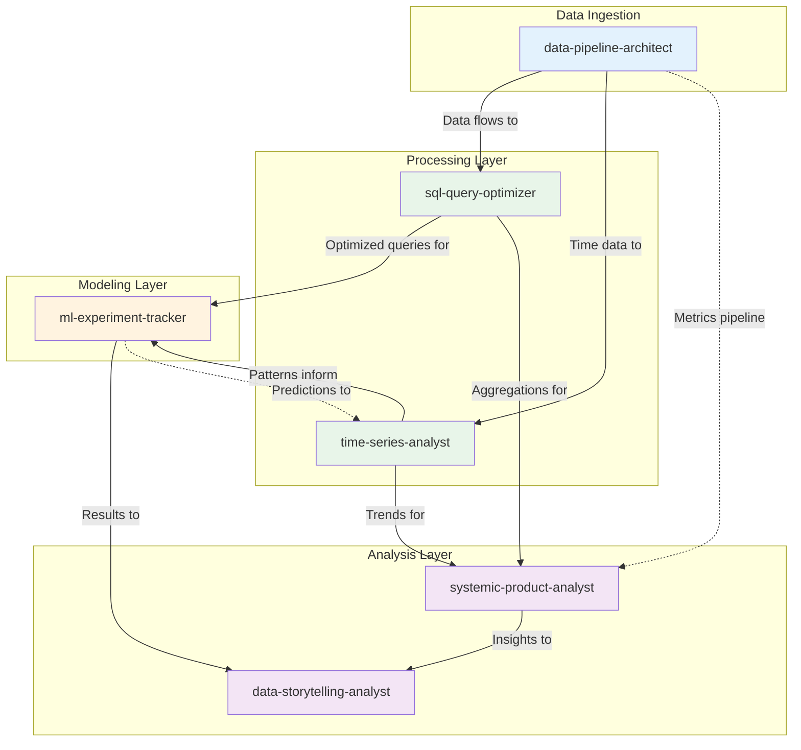
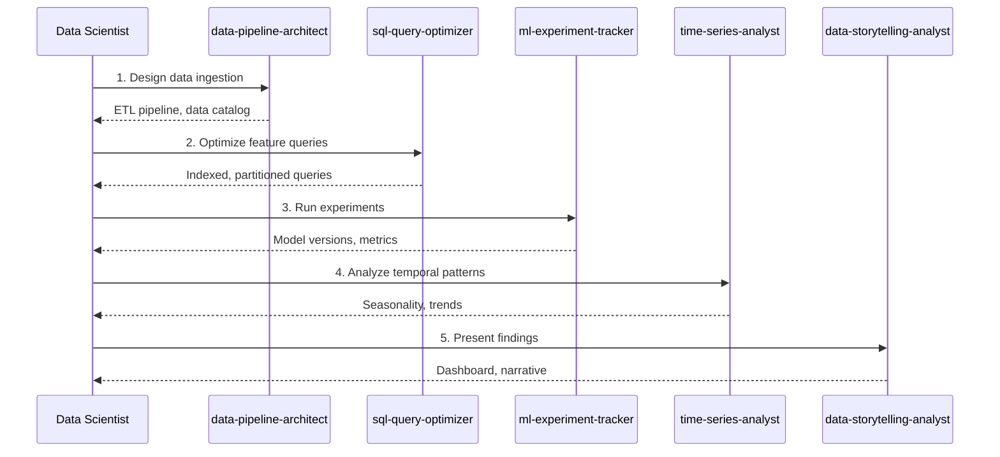
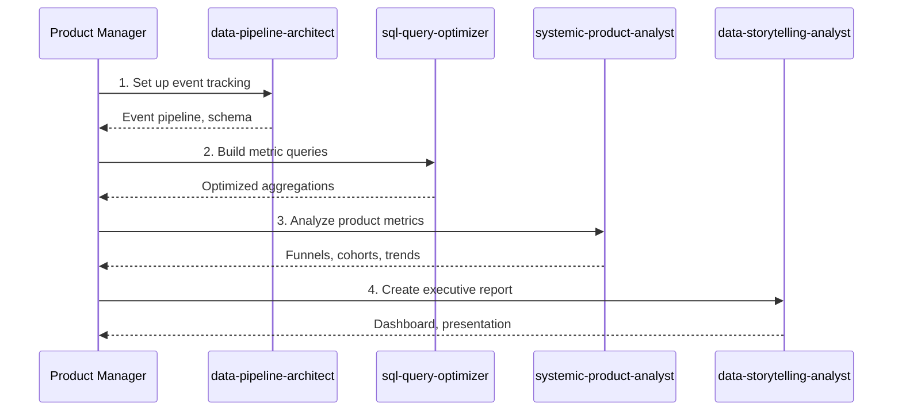
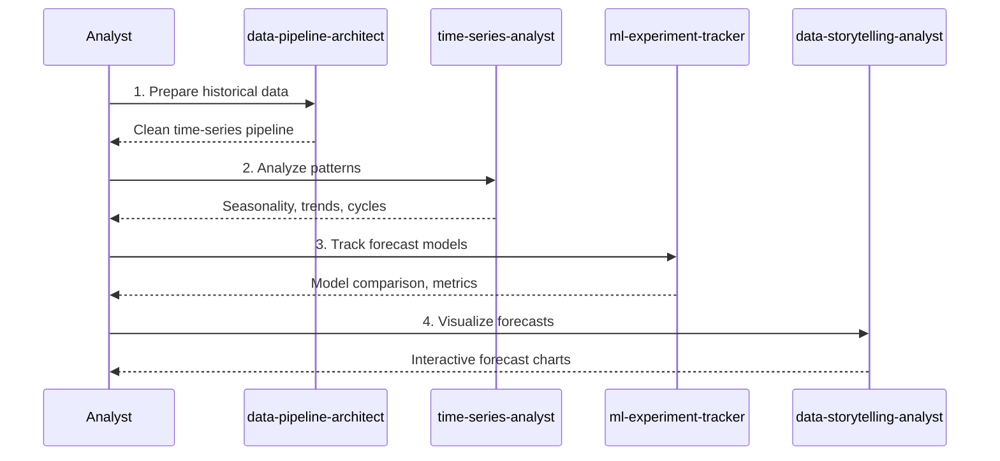
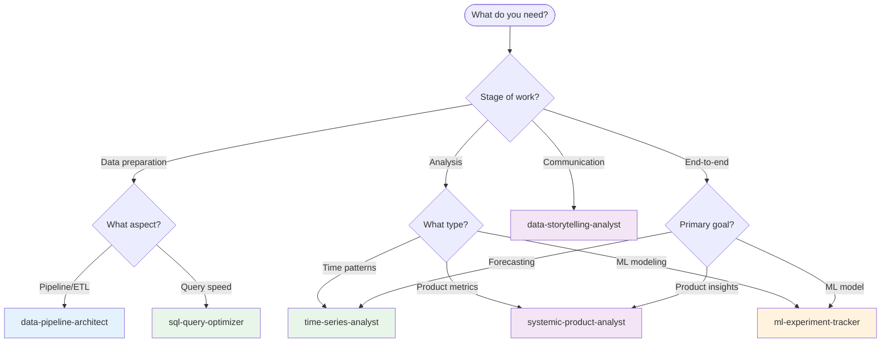

# Data Science & Analytics Skills Ecosystem

This guide maps the relationships between data science and analytics-focused skills in this repository and provides workflow guidance for using them together effectively.

## Skill Overview

| Skill | Category | Focus Area |
|-------|----------|------------|
| [`data-pipeline-architect`](../../skills/data/data-pipeline-architect/) | data | ETL/ELT orchestration and data flow |
| [`sql-query-optimizer`](../../skills/data/sql-query-optimizer/) | data | Query performance and optimization |
| [`data-storytelling-analyst`](../../skills/data/data-storytelling-analyst/) | data | Visualization and narrative |
| [`ml-experiment-tracker`](../../skills/data/ml-experiment-tracker/) | data | Model development lifecycle |
| [`time-series-analyst`](../../skills/data/time-series-analyst/) | data | Temporal pattern analysis |
| [`systemic-product-analyst`](../../skills/data/systemic-product-analyst/) | data | Product metrics and system analysis |

## Ecosystem Diagram

## Workflow Scenarios

### Scenario 1: ML Pipeline

**Goal:** Build an end-to-end machine learning pipeline from data to insights.

**Skill Sequence:**
1. **`data-pipeline-architect`** - Design data ingestion and transformation
2. **`sql-query-optimizer`** - Optimize feature extraction queries
3. **`ml-experiment-tracker`** - Track model experiments
4. **`time-series-analyst`** - Analyze temporal aspects
5. **`data-storytelling-analyst`** - Present results

### Scenario 2: Product Analytics

**Goal:** Build product analytics from data pipeline to executive dashboard.

**Skill Sequence:**
1. **`data-pipeline-architect`** - Set up event data pipeline
2. **`sql-query-optimizer`** - Optimize metric calculations
3. **`systemic-product-analyst`** - Deep dive on product behavior
4. **`data-storytelling-analyst`** - Communicate insights

### Scenario 3: Forecasting Project

**Goal:** Build forecasting models with proper tracking and communication.

**Skill Sequence:**
1. **`data-pipeline-architect`** - Prepare historical data pipeline
2. **`time-series-analyst`** - Identify patterns and features
3. **`ml-experiment-tracker`** - Track forecasting experiments
4. **`data-storytelling-analyst`** - Visualize forecasts

## Decision Tree: Which Skill to Use?

## Cross-Reference Matrix

This matrix shows when each skill might invoke or reference another:

| Primary Skill | Invokes | For |
|---------------|---------|-----|
| `data-pipeline-architect` | `sql-query-optimizer` | Optimizing transformation queries |
| `data-pipeline-architect` | `time-series-analyst` | Time-partitioning strategies |
| `sql-query-optimizer` | `data-pipeline-architect` | Understanding source schemas |
| `sql-query-optimizer` | `ml-experiment-tracker` | Feature query optimization |
| `time-series-analyst` | `data-pipeline-architect` | Time series data requirements |
| `time-series-analyst` | `ml-experiment-tracker` | Forecasting model tracking |
| `ml-experiment-tracker` | `sql-query-optimizer` | Training data queries |
| `ml-experiment-tracker` | `data-storytelling-analyst` | Experiment result visualization |
| `systemic-product-analyst` | `sql-query-optimizer` | Metric query optimization |
| `systemic-product-analyst` | `data-storytelling-analyst` | Insight presentation |
| `data-storytelling-analyst` | All skills | Receiving analysis results |

## Common Handoff Patterns

### Pipeline Architect → SQL Optimizer
When data pipelines are designed, optimize queries:
- Schema is finalized
- Data volumes are known
- Query patterns identified

### SQL Optimizer → ML Experiment Tracker
When feature queries are optimized, track experiments:
- Feature extraction queries ready
- Training data accessible
- Reproducible data loading

### Time Series → ML Experiments
When temporal patterns are identified, track forecasting:
- Seasonality components known
- Feature engineering complete
- Baseline models defined

### Product Analyst → Storytelling
When analysis is complete, communicate:
- Key metrics identified
- Insights synthesized
- Recommendations ready

## Best Practices

### Sequential vs. Parallel Usage
- **Sequential:** ML pipeline (pipeline → optimizer → experiments → story)
- **Parallel:** Time-series + product analyst can analyze simultaneously

### Avoiding Overlap
- **Data concerns:** `data-pipeline-architect` owns ETL/ELT
- **Query concerns:** `sql-query-optimizer` owns query performance
- **Temporal concerns:** `time-series-analyst` owns time patterns
- **Model concerns:** `ml-experiment-tracker` owns model lifecycle
- **Product concerns:** `systemic-product-analyst` owns product metrics
- **Communication concerns:** `data-storytelling-analyst` owns visualization

### When to Combine Skills
Some tasks benefit from multiple skills in one session:
- **Full ML project:** pipeline + optimizer + experiments + storytelling
- **Product deep dive:** pipeline + product analyst + storytelling
- **Forecasting:** pipeline + time-series + experiments + storytelling

## Related Resources

- [Creating Skills Guide](./creating-skills.md)
- [Skill Specification](../api/skill-spec.md)
- [Getting Started](./getting-started.md)
