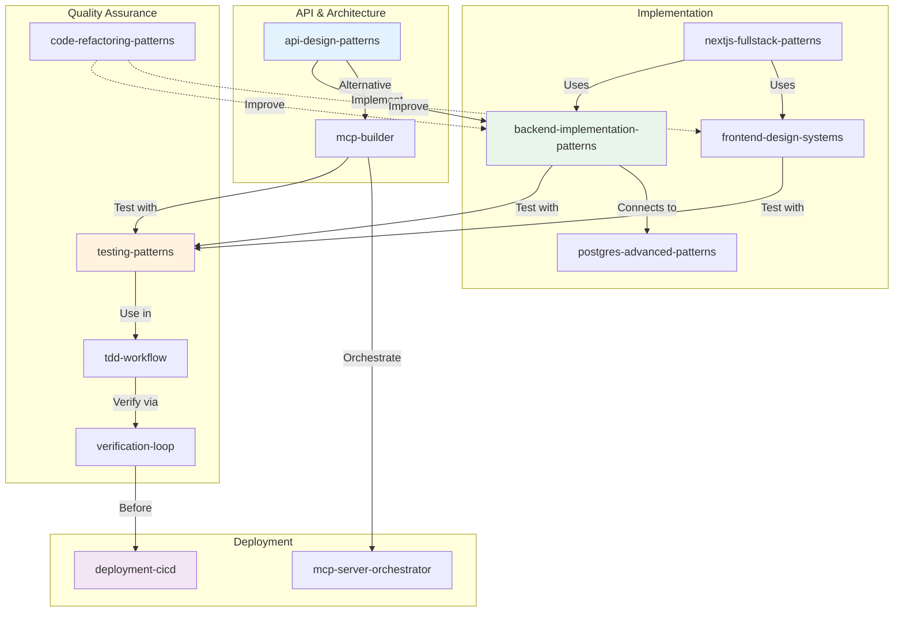
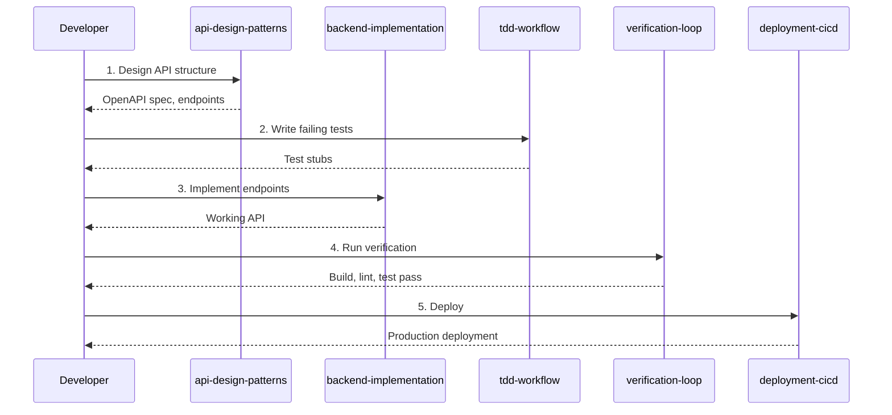
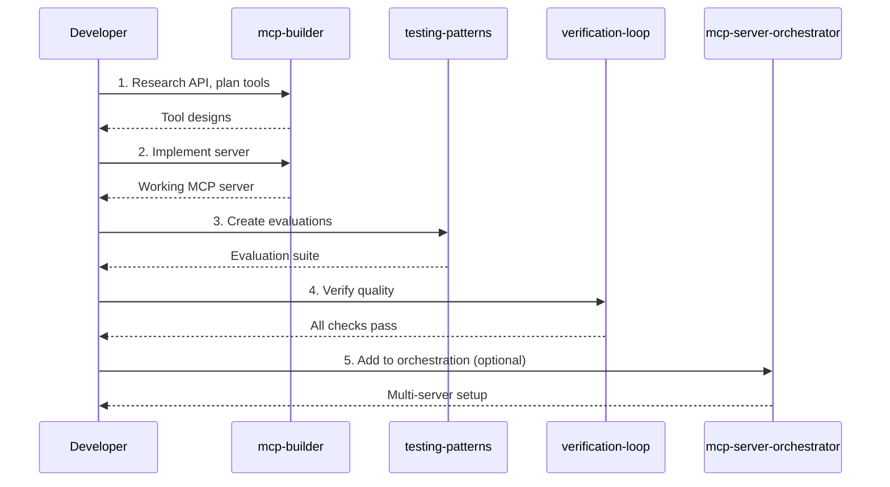
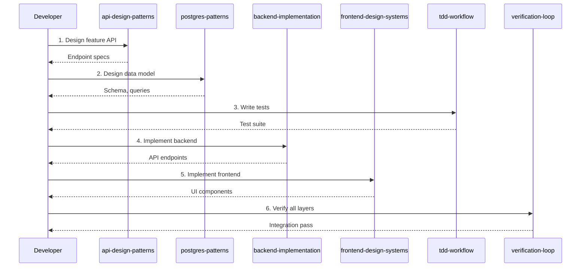
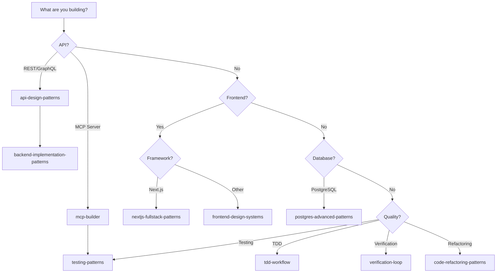

# Development Patterns Ecosystem

This guide maps the relationships between development-focused skills in this repository and provides workflow guidance for using them together effectively.

## Skill Overview

| Skill | Category | Focus Area |
|-------|----------|------------|
| [`api-design-patterns`](../../skills/development/api-design-patterns/) | development | REST, GraphQL, versioning |
| [`backend-implementation-patterns`](../../skills/development/backend-implementation-patterns/) | development | API implementation, auth, validation |
| [`testing-patterns`](../../skills/development/testing-patterns/) | development | Unit, integration, E2E testing |
| [`tdd-workflow`](../../skills/development/tdd-workflow/) | development | Test-driven development process |
| [`verification-loop`](../../skills/development/verification-loop/) | development | Pre-commit quality verification |
| [`code-refactoring-patterns`](../../skills/development/code-refactoring-patterns/) | development | Refactoring techniques |
| [`deployment-cicd`](../../skills/development/deployment-cicd/) | development | CI/CD pipelines |
| [`mcp-builder`](../../skills/development/mcp-builder/) | development | MCP server development |
| [`mcp-server-orchestrator`](../../skills/development/mcp-server-orchestrator/) | development | Multi-server coordination |
| [`frontend-design-systems`](../../skills/development/frontend-design-systems/) | development | Component libraries |
| [`responsive-design-patterns`](../../skills/development/responsive-design-patterns/) | development | Mobile-first design |
| [`nextjs-fullstack-patterns`](../../skills/development/nextjs-fullstack-patterns/) | development | Next.js App Router |
| [`postgres-advanced-patterns`](../../skills/development/postgres-advanced-patterns/) | development | Database optimization |
| [`rust-systems-design`](../../skills/development/rust-systems-design/) | development | Rust architecture |
| [`accessibility-patterns`](../../skills/development/accessibility-patterns/) | development | WCAG compliance |

## Ecosystem Diagram



## Workflow Scenarios

### Scenario 1: New API Development

**Goal:** Build a production-ready REST API from design to deployment.



**Skill Sequence:**
1. **`api-design-patterns`** - Design endpoints, response formats, error handling
2. **`tdd-workflow`** - Write tests for each endpoint
3. **`backend-implementation-patterns`** - Implement API logic
4. **`verification-loop`** - Ensure all quality gates pass
5. **`deployment-cicd`** - Set up CI pipeline and deploy

### Scenario 2: MCP Server Development

**Goal:** Create an MCP server that integrates with external services.



**Skill Sequence:**
1. **`mcp-builder`** - Deep research, plan tools, implement server
2. **`testing-patterns`** - Create evaluation questions
3. **`verification-loop`** - Run quality checks
4. **`mcp-server-orchestrator`** - Coordinate with other servers (if needed)

### Scenario 3: Full-Stack Feature Development

**Goal:** Add a feature spanning frontend, backend, and database.



**Skill Sequence:**
1. **`api-design-patterns`** - Design feature endpoints
2. **`postgres-advanced-patterns`** - Data modeling, queries
3. **`tdd-workflow`** - Test-first approach
4. **`backend-implementation-patterns`** - Backend logic
5. **`frontend-design-systems`** - UI components
6. **`verification-loop`** - End-to-end verification

## Decision Tree: Which Development Skill?



## Cross-Reference Matrix

| When using... | Consider also... | Reason |
|---------------|------------------|--------|
| api-design-patterns | backend-implementation-patterns | Design then implement |
| backend-implementation-patterns | postgres-advanced-patterns | Data layer integration |
| testing-patterns | tdd-workflow | TDD uses testing patterns |
| tdd-workflow | verification-loop | Verify before commit |
| mcp-builder | testing-patterns | Evaluation suite |
| frontend-design-systems | accessibility-patterns | Inclusive design |
| nextjs-fullstack-patterns | deployment-cicd | Vercel/deployment |

## Handoff Patterns

### From Design to Implementation
```
api-design-patterns → backend-implementation-patterns
├─ Pass: OpenAPI spec, endpoint list
├─ Expect: Implementation follows spec
└─ Verify: Responses match documented formats
```

### From Implementation to Testing
```
backend-implementation-patterns → testing-patterns
├─ Pass: Endpoint implementations
├─ Expect: Unit + integration tests
└─ Verify: Coverage > 80%
```

### From Testing to Deployment
```
verification-loop → deployment-cicd
├─ Pass: All checks green
├─ Expect: CI pipeline succeeds
└─ Verify: Deployed version works
```

## Integration Checklist

### Starting a New Project
- [ ] Choose API approach (REST/GraphQL vs MCP)
- [ ] Design data model with `postgres-advanced-patterns`
- [ ] Set up testing with `testing-patterns`
- [ ] Configure CI with `deployment-cicd`

### Adding a Feature
- [ ] Design endpoints with `api-design-patterns`
- [ ] Write tests first with `tdd-workflow`
- [ ] Implement with `backend-implementation-patterns`
- [ ] Verify with `verification-loop`

### Improving Code Quality
- [ ] Refactor with `code-refactoring-patterns`
- [ ] Add tests with `testing-patterns`
- [ ] Verify changes with `verification-loop`
