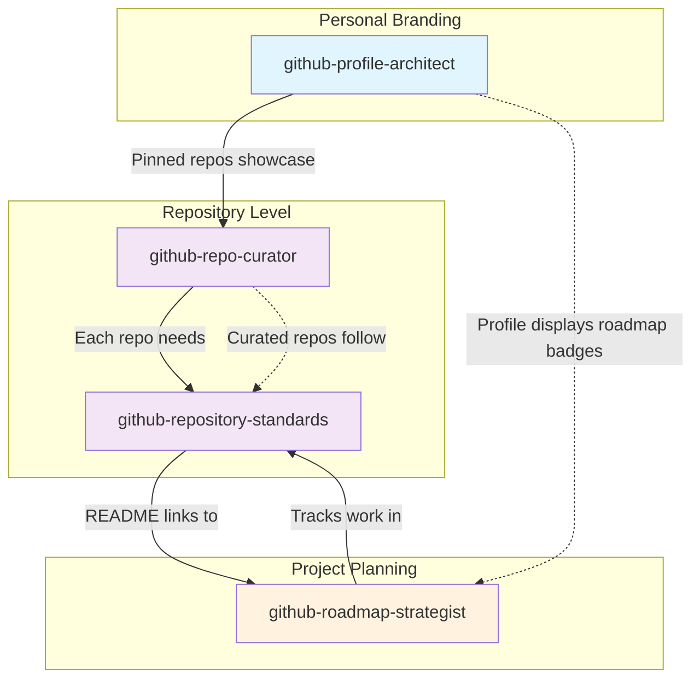
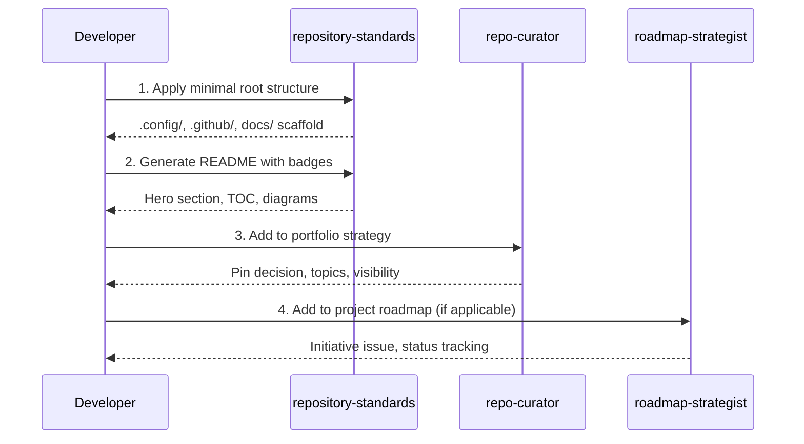
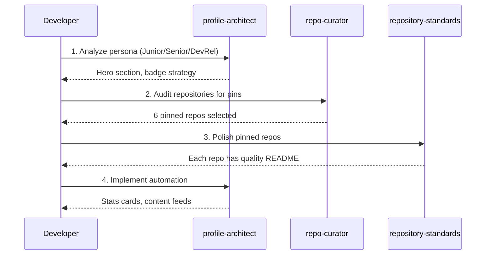
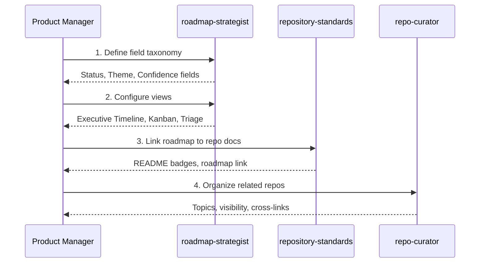
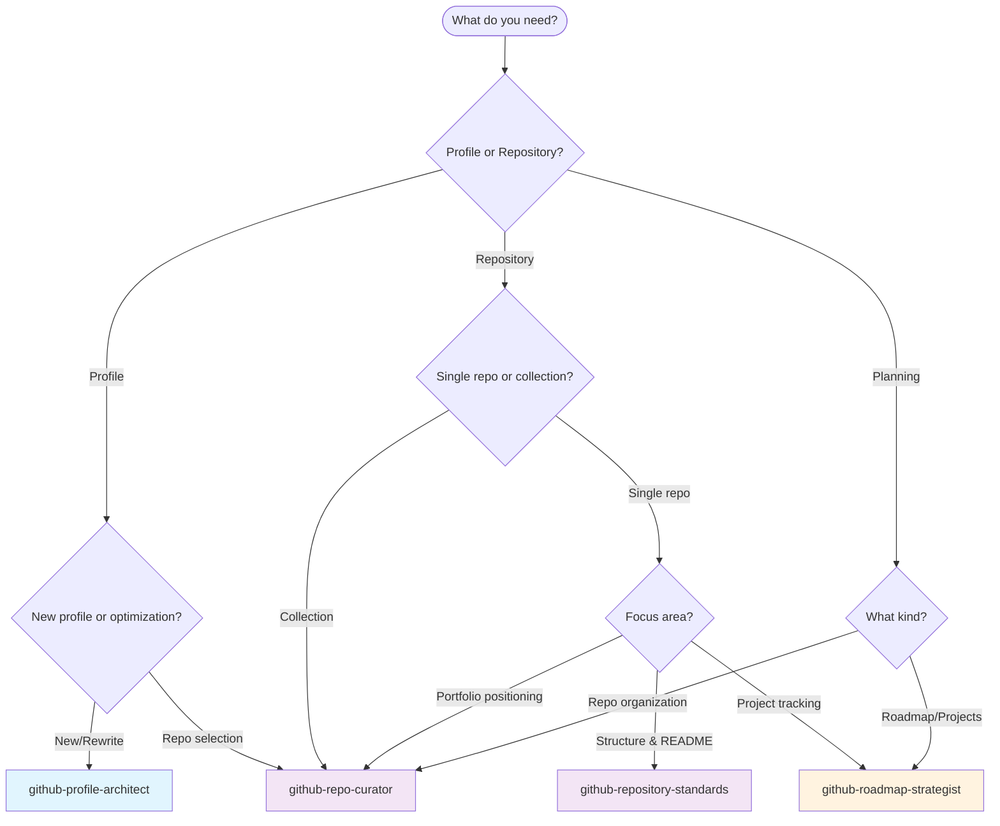

# GitHub Skills Ecosystem

This guide maps the relationships between GitHub-focused skills in this repository and provides workflow guidance for using them together effectively.

## Skill Overview

| Skill | Category | Focus Area |
|-------|----------|------------|
| [`github-profile-architect`](../../skills/documentation/github-profile-architect/) | documentation | Personal branding via Profile README |
| [`github-repo-curator`](../../skills/documentation/github-repo-curator/) | documentation | Repository organization & portfolio |
| [`github-repository-standards`](../../skills/documentation/github-repository-standards/) | documentation | Minimal root & README standards |
| [`github-roadmap-strategist`](../../skills/project-management/github-roadmap-strategist/) | project-management | GitHub Projects V2 & planning |

## Ecosystem Diagram

## Workflow Scenarios

### Scenario 1: New Repository Setup

**Goal:** Create a professional, well-documented repository from scratch.

**Skill Sequence:**
1. **`github-repository-standards`** - Establish directory structure and README
2. **`github-repo-curator`** - Position within portfolio, set visibility
3. **`github-roadmap-strategist`** - Track ongoing work (optional)

### Scenario 2: Profile Optimization

**Goal:** Transform a GitHub profile into a professional landing page.

**Skill Sequence:**
1. **`github-profile-architect`** - Define persona and hero section
2. **`github-repo-curator`** - Select and position pinned repositories
3. **`github-repository-standards`** - Ensure each pinned repo is polished
4. **`github-profile-architect`** - Add dynamic automation (Actions)

### Scenario 3: Project Planning Setup

**Goal:** Establish GitHub Projects as the roadmap system.

**Skill Sequence:**
1. **`github-roadmap-strategist`** - Configure Projects V2 and governance
2. **`github-repository-standards`** - Add roadmap badges to READMEs
3. **`github-repo-curator`** - Organize related repositories

### Scenario 4: Open Source Launch

**Goal:** Prepare a project for public open source release.

**Skill Sequence:**
1. **`github-repository-standards`** - Minimal root, world-class README
2. **`github-repo-curator`** - License selection, community files
3. **`github-profile-architect`** - Pin and showcase on profile
4. **`github-roadmap-strategist`** - Public roadmap (Shadow Item pattern)

## Decision Tree: Which Skill to Use?

## Cross-Reference Matrix

This matrix shows when each skill might invoke or reference another:

| Primary Skill | Invokes | For |
|---------------|---------|-----|
| `profile-architect` | `repo-curator` | Selecting pinned repositories |
| `profile-architect` | `repository-standards` | Ensuring pinned repos have quality READMEs |
| `repo-curator` | `repository-standards` | Applying README templates to repos |
| `repo-curator` | `profile-architect` | Updating profile after repo changes |
| `repository-standards` | `roadmap-strategist` | Adding roadmap badges/links |
| `repository-standards` | `repo-curator` | Positioning repo in portfolio |
| `roadmap-strategist` | `repository-standards` | Creating tracking issues with standards |
| `roadmap-strategist` | `repo-curator` | Organizing roadmap-related repos |

## Common Handoff Patterns

### Profile Architect → Repo Curator
When building a profile, the architect identifies repos to pin. Hand off to the curator for:
- Visibility audit (public/private decisions)
- Topic/tag strategy
- Cross-linking related projects

### Repo Curator → Repository Standards
After selecting which repos to showcase, apply standards for:
- Minimal root structure
- Badge dashboard
- Mermaid diagrams

### Repository Standards → Roadmap Strategist
When a repo needs ongoing tracking:
- Add roadmap badge to README
- Create initiative issue
- Link to Project board

### Roadmap Strategist → Repository Standards
When roadmap items ship:
- Update README with new features
- Archive completed milestones
- Add changelog entries

## Best Practices

### Sequential vs. Parallel Usage
- **Sequential:** New repo setup (standards → curator → profile)
- **Parallel:** Profile refresh (architect + curator simultaneously)

### Avoiding Overlap
- **Profile-level concerns:** `profile-architect` owns the `username/username` repo
- **Repo-level concerns:** `repository-standards` owns individual repo structure
- **Collection concerns:** `repo-curator` owns cross-repo organization
- **Tracking concerns:** `roadmap-strategist` owns GitHub Projects

### When to Combine Skills
Some tasks benefit from multiple skills in one session:
- **Portfolio refresh:** curator + standards + architect
- **Open source launch:** standards + curator + roadmap (public)
- **Quarterly review:** curator (audit) + roadmap (metrics)

## Related Resources

- [Creating Skills Guide](./creating-skills.md)
- [Skill Specification](../api/skill-spec.md)
- [Getting Started](./getting-started.md)
