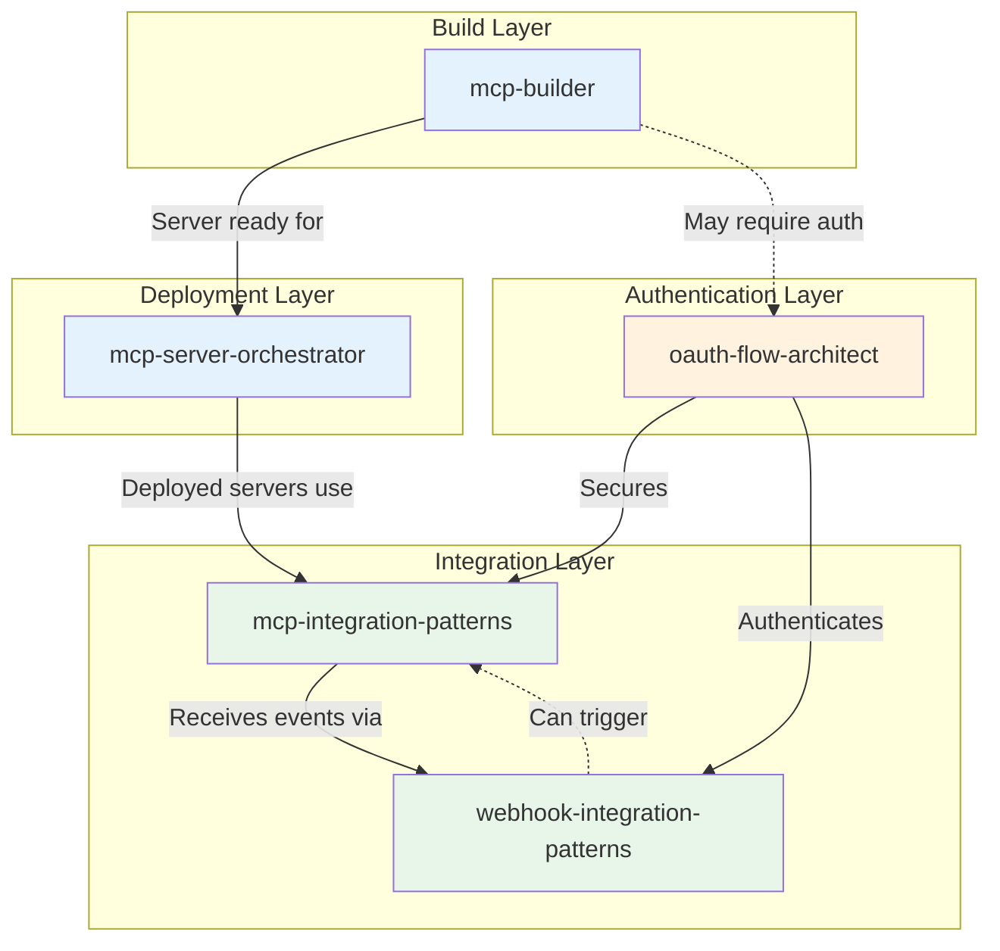
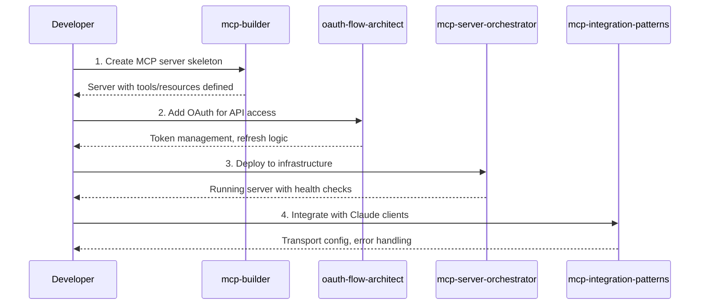
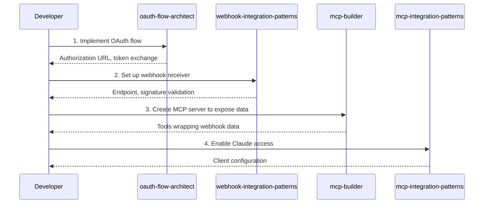
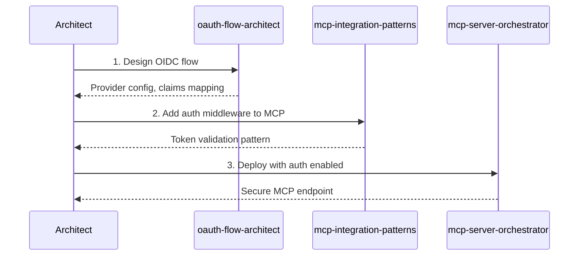
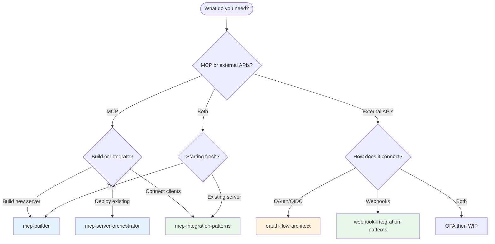

# Integration & Authentication Skills Ecosystem

This guide maps the relationships between integration and authentication-focused skills in this repository and provides workflow guidance for using them together effectively.

## Skill Overview

| Skill | Category | Focus Area |
|-------|----------|------------|
| [`mcp-integration-patterns`](../../skills/integrations/mcp-integration-patterns/) | integrations | MCP server/client integration patterns |
| [`mcp-builder`](../../skills/development/mcp-builder/) | development | Building MCP servers from scratch |
| [`mcp-server-orchestrator`](../../skills/development/mcp-server-orchestrator/) | development | Deploying and managing MCP infrastructure |
| [`oauth-flow-architect`](../../skills/integrations/oauth-flow-architect/) | integrations | OAuth 2.0/OIDC implementation patterns |
| [`webhook-integration-patterns`](../../skills/integrations/webhook-integration-patterns/) | integrations | Reliable webhook design and handling |

## Ecosystem Diagram

## Workflow Scenarios

### Scenario 1: Claude MCP Integration

**Goal:** Build and deploy an MCP server that integrates with third-party APIs.

**Skill Sequence:**
1. **`mcp-builder`** - Define server structure, tools, and resources
2. **`oauth-flow-architect`** - Implement authentication for external APIs
3. **`mcp-server-orchestrator`** - Deploy server with proper configuration
4. **`mcp-integration-patterns`** - Configure client integration patterns

### Scenario 2: Third-Party API Integration

**Goal:** Connect a service to your application via OAuth and webhooks.

**Skill Sequence:**
1. **`oauth-flow-architect`** - Authenticate with third-party service
2. **`webhook-integration-patterns`** - Receive real-time events
3. **`mcp-builder`** - Expose webhook data as MCP tools
4. **`mcp-integration-patterns`** - Connect to Claude clients

### Scenario 3: Enterprise SSO Setup

**Goal:** Implement single sign-on with MCP authentication middleware.

**Skill Sequence:**
1. **`oauth-flow-architect`** - Configure OIDC with identity provider
2. **`mcp-integration-patterns`** - Implement auth middleware for MCP
3. **`mcp-server-orchestrator`** - Deploy with authentication layer

## Decision Tree: Which Skill to Use?

## Cross-Reference Matrix

This matrix shows when each skill might invoke or reference another:

| Primary Skill | Invokes | For |
|---------------|---------|-----|
| `mcp-builder` | `oauth-flow-architect` | Adding authentication to server tools |
| `mcp-builder` | `mcp-integration-patterns` | Following protocol conventions |
| `mcp-server-orchestrator` | `mcp-builder` | Understanding server structure |
| `mcp-server-orchestrator` | `oauth-flow-architect` | Configuring auth in deployment |
| `mcp-integration-patterns` | `oauth-flow-architect` | Securing client connections |
| `mcp-integration-patterns` | `webhook-integration-patterns` | Receiving external events |
| `oauth-flow-architect` | `webhook-integration-patterns` | Token refresh via callbacks |
| `webhook-integration-patterns` | `oauth-flow-architect` | Validating webhook signatures |

## Common Handoff Patterns

### MCP Builder → OAuth Flow Architect
When building an MCP server that needs to call authenticated APIs:
- Server skeleton complete
- Tool definitions that require API calls
- Need to store and refresh tokens

### OAuth Flow Architect → Webhook Integration
After OAuth is set up, you often need to receive events:
- OAuth tokens enable webhook subscription
- Webhook validates using OAuth credentials
- Combined for real-time data sync

### MCP Builder → MCP Server Orchestrator
When the server is ready for deployment:
- Server code complete and tested
- Configuration for different environments
- Health check endpoints defined

### MCP Server Orchestrator → MCP Integration Patterns
After deployment, connect clients:
- Server URL and transport method
- Authentication configuration
- Error handling patterns

## Best Practices

### Sequential vs. Parallel Usage
- **Sequential:** New integration (builder → oauth → orchestrator → patterns)
- **Parallel:** Auth + webhooks simultaneously when both needed

### Avoiding Overlap
- **Build concerns:** `mcp-builder` owns server code
- **Deploy concerns:** `mcp-server-orchestrator` owns infrastructure
- **Auth concerns:** `oauth-flow-architect` owns token management
- **Event concerns:** `webhook-integration-patterns` owns event handling
- **Protocol concerns:** `mcp-integration-patterns` owns MCP conventions

### When to Combine Skills
Some tasks benefit from multiple skills in one session:
- **Full MCP pipeline:** builder + orchestrator + patterns
- **Authenticated webhooks:** oauth + webhooks
- **Secure MCP:** builder + oauth + patterns

## Related Resources

- [Creating Skills Guide](./creating-skills.md)
- [Skill Specification](../api/skill-spec.md)
- [Getting Started](./getting-started.md)
