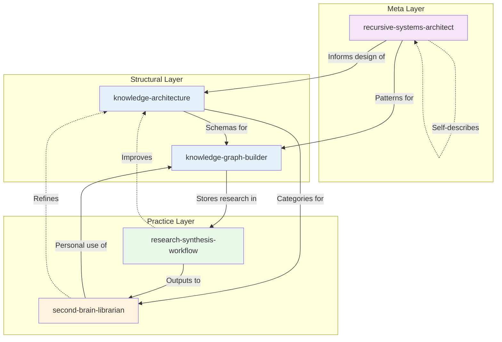
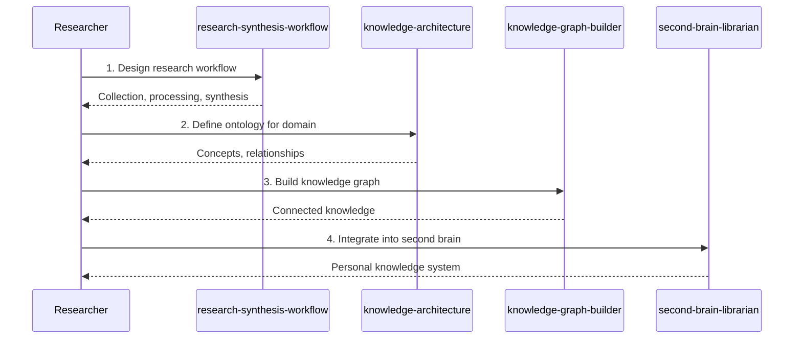
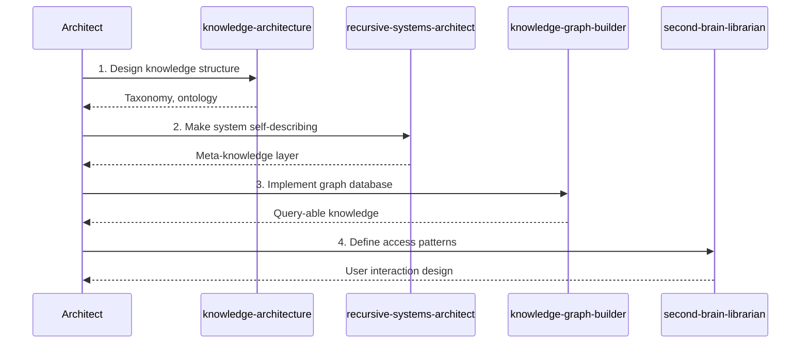
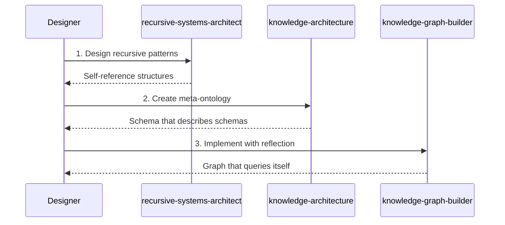
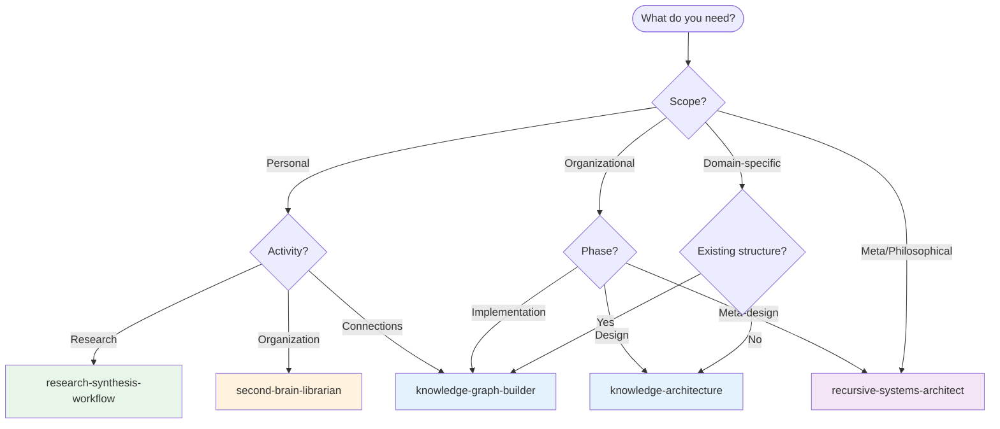
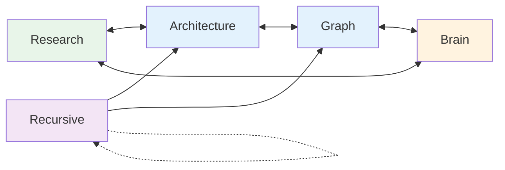

# Knowledge Management Skills Ecosystem

This guide maps the relationships between knowledge management skills in this repository and provides workflow guidance for using them together effectively.

## Skill Overview

| Skill | Category | Focus Area |
|-------|----------|------------|
| [`knowledge-architecture`](../../skills/knowledge/knowledge-architecture/) | knowledge | Ontological design and structure |
| [`knowledge-graph-builder`](../../skills/knowledge/knowledge-graph-builder/) | knowledge | Graph implementation and queries |
| [`research-synthesis-workflow`](../../skills/knowledge/research-synthesis-workflow/) | knowledge | Research systematization |
| [`second-brain-librarian`](../../skills/knowledge/second-brain-librarian/) | knowledge | Personal knowledge management |
| [`recursive-systems-architect`](../../skills/knowledge/recursive-systems-architect/) | knowledge | Self-referential systems design |

## Ecosystem Diagram

## Workflow Scenarios

### Scenario 1: Research Project

**Goal:** Systematically research and synthesize knowledge into a personal system.

**Skill Sequence:**
1. **`research-synthesis-workflow`** - Design systematic research approach
2. **`knowledge-architecture`** - Define domain ontology
3. **`knowledge-graph-builder`** - Implement as connected graph
4. **`second-brain-librarian`** - Integrate into personal system

### Scenario 2: Knowledge Base Creation

**Goal:** Design and build an organizational knowledge base.

**Skill Sequence:**
1. **`knowledge-architecture`** - Design organizational structure
2. **`recursive-systems-architect`** - Add meta-layer for system evolution
3. **`knowledge-graph-builder`** - Implement graph storage
4. **`second-brain-librarian`** - Design user access patterns

### Scenario 3: Self-Referential System

**Goal:** Create a system that can describe and improve itself.

**Skill Sequence:**
1. **`recursive-systems-architect`** - Design self-referential patterns
2. **`knowledge-architecture`** - Create meta-level ontology
3. **`knowledge-graph-builder`** - Implement with introspection

## Decision Tree: Which Skill to Use?

## Cross-Reference Matrix

This matrix shows when each skill might invoke or reference another:

| Primary Skill | Invokes | For |
|---------------|---------|-----|
| `knowledge-architecture` | `knowledge-graph-builder` | Implementing the ontology |
| `knowledge-architecture` | `recursive-systems-architect` | Meta-level design |
| `knowledge-graph-builder` | `knowledge-architecture` | Schema guidance |
| `knowledge-graph-builder` | `second-brain-librarian` | Personal use patterns |
| `research-synthesis-workflow` | `knowledge-architecture` | Domain structure |
| `research-synthesis-workflow` | `knowledge-graph-builder` | Knowledge storage |
| `second-brain-librarian` | `knowledge-architecture` | Organizational categories |
| `second-brain-librarian` | `knowledge-graph-builder` | Connection implementation |
| `recursive-systems-architect` | `knowledge-architecture` | Meta-ontology design |
| `recursive-systems-architect` | `knowledge-graph-builder` | Self-referential implementation |

## Common Handoff Patterns

### Architecture → Graph Builder
When ontology is defined, implement it:
- Entity definitions
- Relationship types
- Constraints and rules
- Query patterns

### Research Workflow → Second Brain
When research is synthesized, internalize it:
- Key insights
- Source references
- Connection points
- Actionable knowledge

### Recursive Architect → Architecture
When meta-patterns are designed, apply them:
- Schema of schemas
- Evolution patterns
- Self-improvement mechanisms

### Second Brain → Knowledge Architecture
When personal patterns emerge, formalize them:
- Emerging categories
- Usage patterns
- Natural connections

## Best Practices

### Sequential vs. Parallel Usage
- **Sequential:** New knowledge base (architecture → graph → librarian)
- **Parallel:** Research + second brain maintenance can coexist

### Avoiding Overlap
- **Structural concerns:** `knowledge-architecture` owns ontology design
- **Implementation concerns:** `knowledge-graph-builder` owns graph technology
- **Research concerns:** `research-synthesis-workflow` owns research process
- **Personal concerns:** `second-brain-librarian` owns personal knowledge
- **Meta concerns:** `recursive-systems-architect` owns self-reference

### When to Combine Skills
Some projects benefit from multiple skills:
- **Research to knowledge:** workflow + architecture + graph + brain
- **Organizational KB:** architecture + graph + recursive
- **Personal system:** brain + architecture + graph

## Flexible Relationships

Unlike linear ecosystems, knowledge management has fluid relationships:

Knowledge flows in all directions, with each skill enriching the others. The recursive architect provides meta-patterns that can be applied anywhere.

## Related Resources

- [Creating Skills Guide](./creating-skills.md)
- [Skill Specification](../api/skill-spec.md)
- [Getting Started](./getting-started.md)
