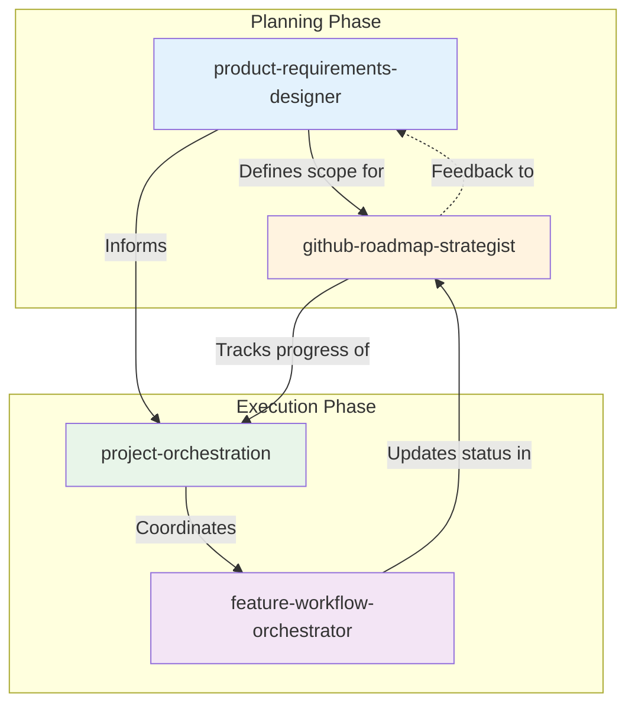
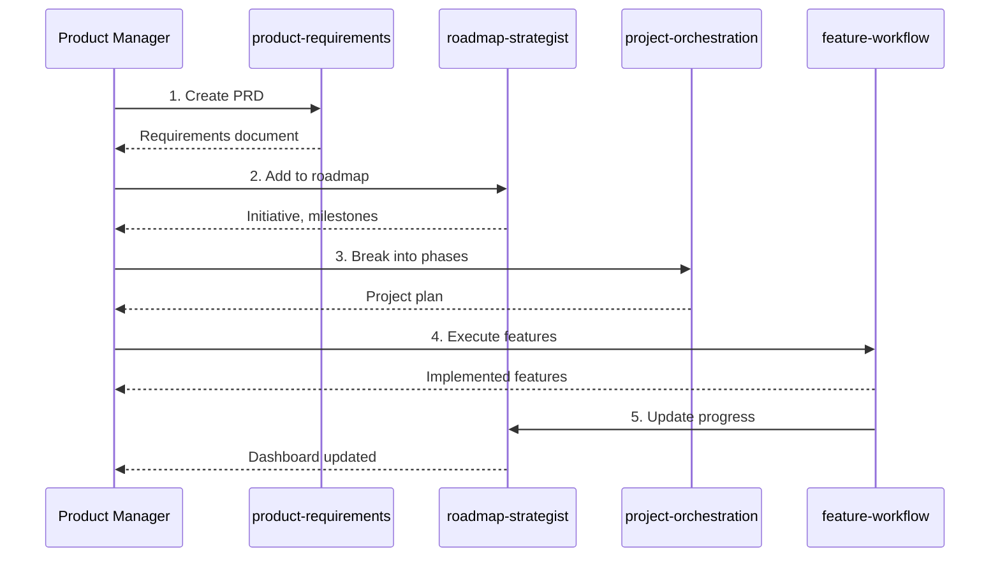
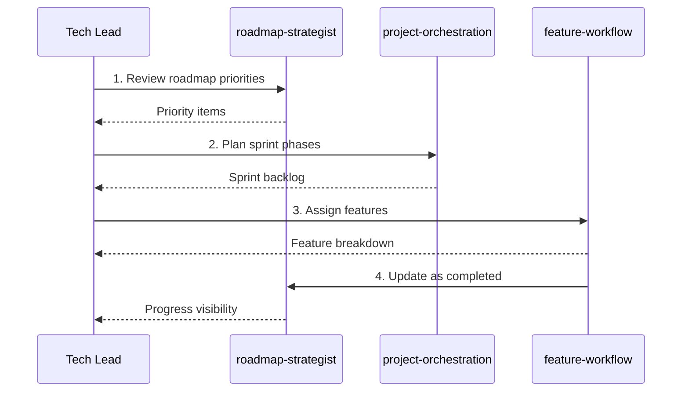
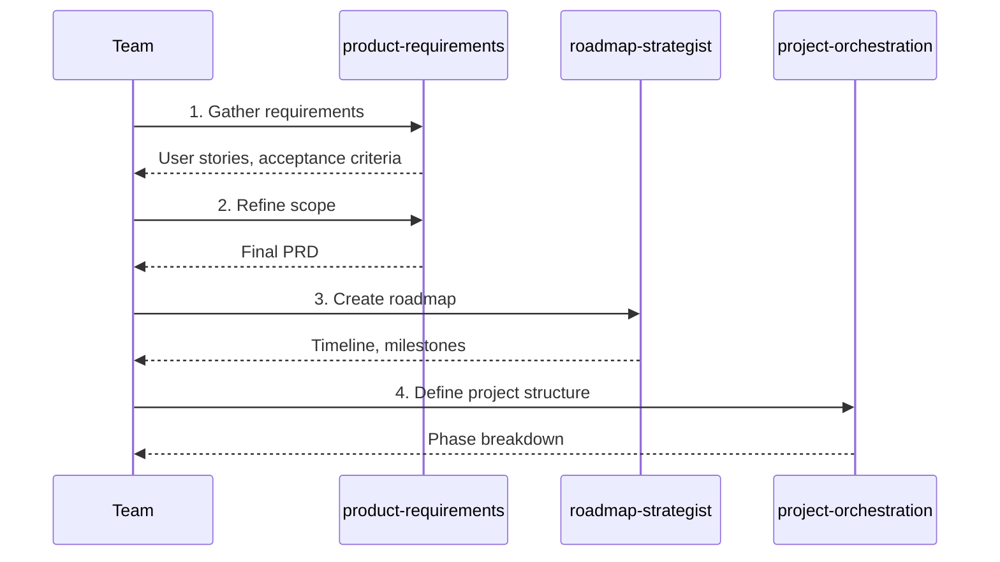
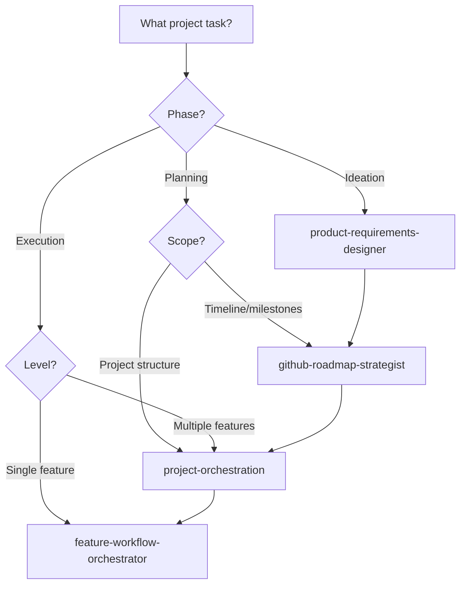

# Project Workflow Ecosystem

This guide maps the relationships between project management and workflow skills in this repository and provides guidance for using them together effectively.

## Skill Overview

| Skill | Category | Focus Area |
|-------|----------|------------|
| [`feature-workflow-orchestrator`](../../skills/development/feature-workflow-orchestrator/) | development | End-to-end feature development |
| [`project-orchestration`](../../skills/project-management/project-orchestration/) | project-management | Multi-phase project coordination |
| [`product-requirements-designer`](../../skills/project-management/product-requirements-designer/) | project-management | PRD creation and refinement |
| [`github-roadmap-strategist`](../../skills/project-management/github-roadmap-strategist/) | project-management | GitHub Projects V2, roadmaps |

## Ecosystem Diagram



## Workflow Scenarios

### Scenario 1: New Product Feature

**Goal:** Take a feature from concept through delivery with proper tracking.



**Skill Sequence:**
1. **`product-requirements-designer`** - Define the feature requirements
2. **`github-roadmap-strategist`** - Plan timeline and milestones
3. **`project-orchestration`** - Break into manageable phases
4. **`feature-workflow-orchestrator`** - Execute individual features
5. **`github-roadmap-strategist`** - Track and report progress

### Scenario 2: Sprint Planning

**Goal:** Plan and execute a development sprint.



**Skill Sequence:**
1. **`github-roadmap-strategist`** - Identify sprint priorities
2. **`project-orchestration`** - Structure the sprint
3. **`feature-workflow-orchestrator`** - Execute features
4. **`github-roadmap-strategist`** - Track completion

### Scenario 3: Product Planning Session

**Goal:** Define and document a new product initiative.



**Skill Sequence:**
1. **`product-requirements-designer`** - Capture and refine requirements
2. **`github-roadmap-strategist`** - Translate to roadmap
3. **`project-orchestration`** - Define execution phases

## Decision Tree: Which Project Skill?



## Cross-Reference Matrix

| When using... | Consider also... | Reason |
|---------------|------------------|--------|
| product-requirements-designer | github-roadmap-strategist | PRD feeds roadmap |
| github-roadmap-strategist | project-orchestration | Roadmap guides execution |
| project-orchestration | feature-workflow-orchestrator | Project contains features |
| feature-workflow-orchestrator | github-roadmap-strategist | Update progress in roadmap |

## Integration with Development Skills

Project workflow skills connect to development skills:

| Project Skill | Connects To | Integration Point |
|---------------|-------------|-------------------|
| feature-workflow-orchestrator | tdd-workflow | TDD within feature development |
| feature-workflow-orchestrator | verification-loop | Verify before feature completion |
| project-orchestration | deployment-cicd | Deploy at phase completion |
| github-roadmap-strategist | github-repository-standards | Link roadmap to repos |

## Handoff Patterns

### From Requirements to Roadmap
```
product-requirements-designer → github-roadmap-strategist
├─ Pass: PRD document, user stories
├─ Expect: Initiatives, milestones, timeline
└─ Verify: All requirements mapped to roadmap items
```

### From Roadmap to Execution
```
github-roadmap-strategist → project-orchestration
├─ Pass: Prioritized items, deadlines
├─ Expect: Phase breakdown, assignments
└─ Verify: Clear ownership and dependencies
```

### From Project to Features
```
project-orchestration → feature-workflow-orchestrator
├─ Pass: Feature scope, acceptance criteria
├─ Expect: Implemented, tested features
└─ Verify: Meets acceptance criteria
```

## Integration Checklist

### New Product Initiative
- [ ] Create PRD with `product-requirements-designer`
- [ ] Build roadmap with `github-roadmap-strategist`
- [ ] Structure project with `project-orchestration`
- [ ] Execute features with `feature-workflow-orchestrator`

### Sprint Planning
- [ ] Review priorities in `github-roadmap-strategist`
- [ ] Plan sprint with `project-orchestration`
- [ ] Break down features with `feature-workflow-orchestrator`

### Progress Tracking
- [ ] Update roadmap status in `github-roadmap-strategist`
- [ ] Review phase completion in `project-orchestration`
- [ ] Close features in `feature-workflow-orchestrator`

## Project Artifacts

| Artifact | Created By | Used By |
|----------|------------|---------|
| PRD | product-requirements-designer | All skills |
| Roadmap | github-roadmap-strategist | project-orchestration |
| Project Plan | project-orchestration | feature-workflow-orchestrator |
| Feature Spec | feature-workflow-orchestrator | Development skills |

## GitHub Integration

All project skills integrate with GitHub:

- **Issues**: Track work items at all levels
- **Projects V2**: Visual project management (roadmap-strategist)
- **Milestones**: Track deadlines and releases
- **Labels**: Categorize and filter work

See [`github-roadmap-strategist`](../../skills/project-management/github-roadmap-strategist/) for detailed GitHub Projects V2 guidance.
