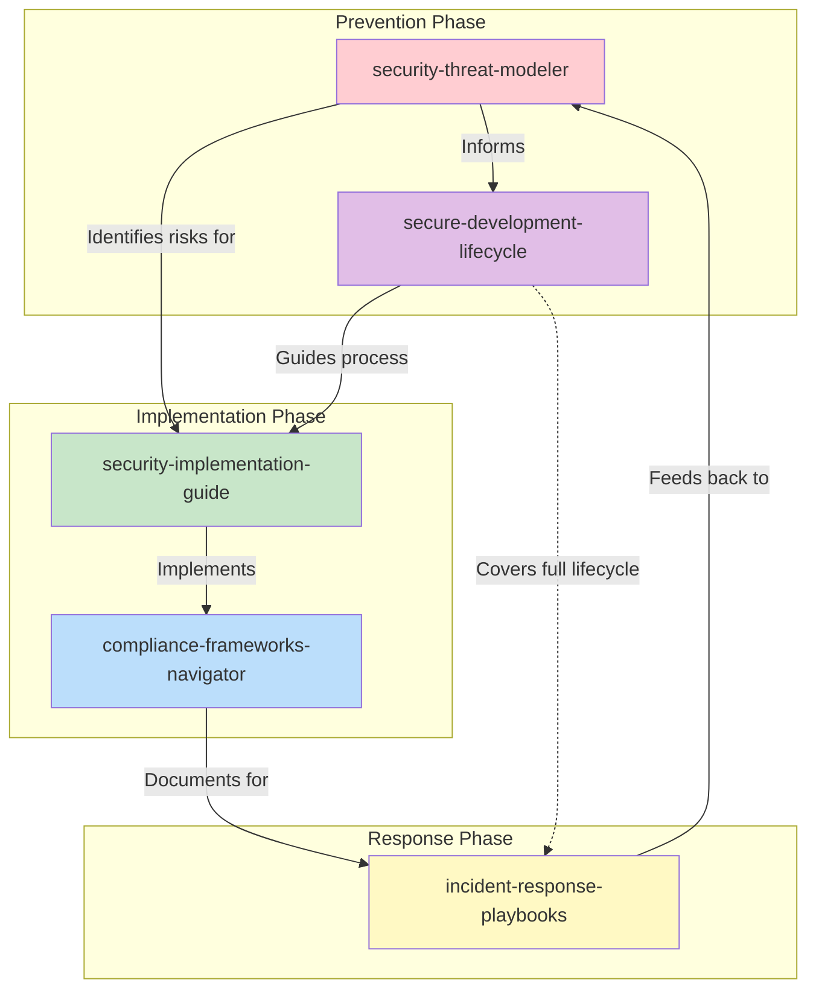
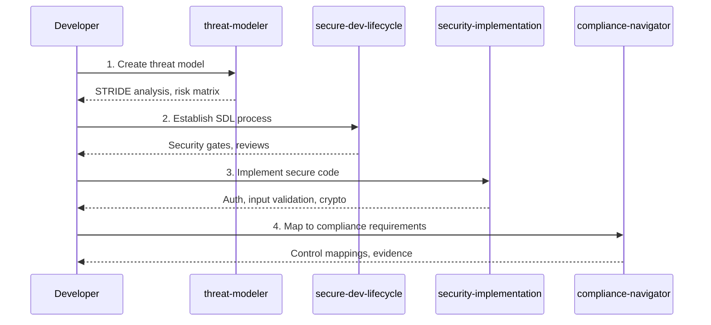
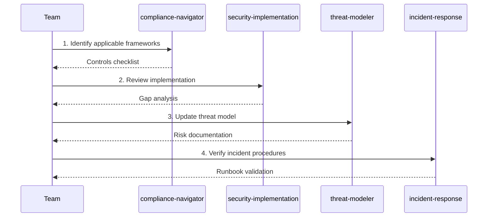
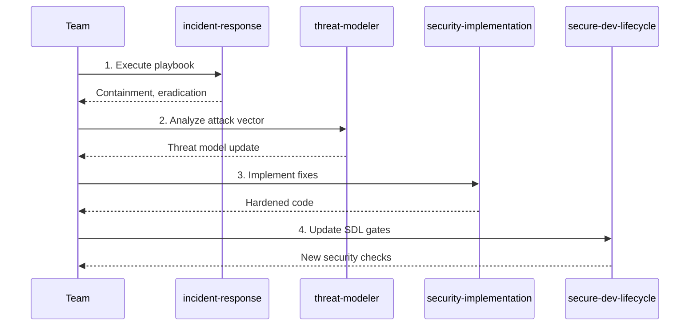
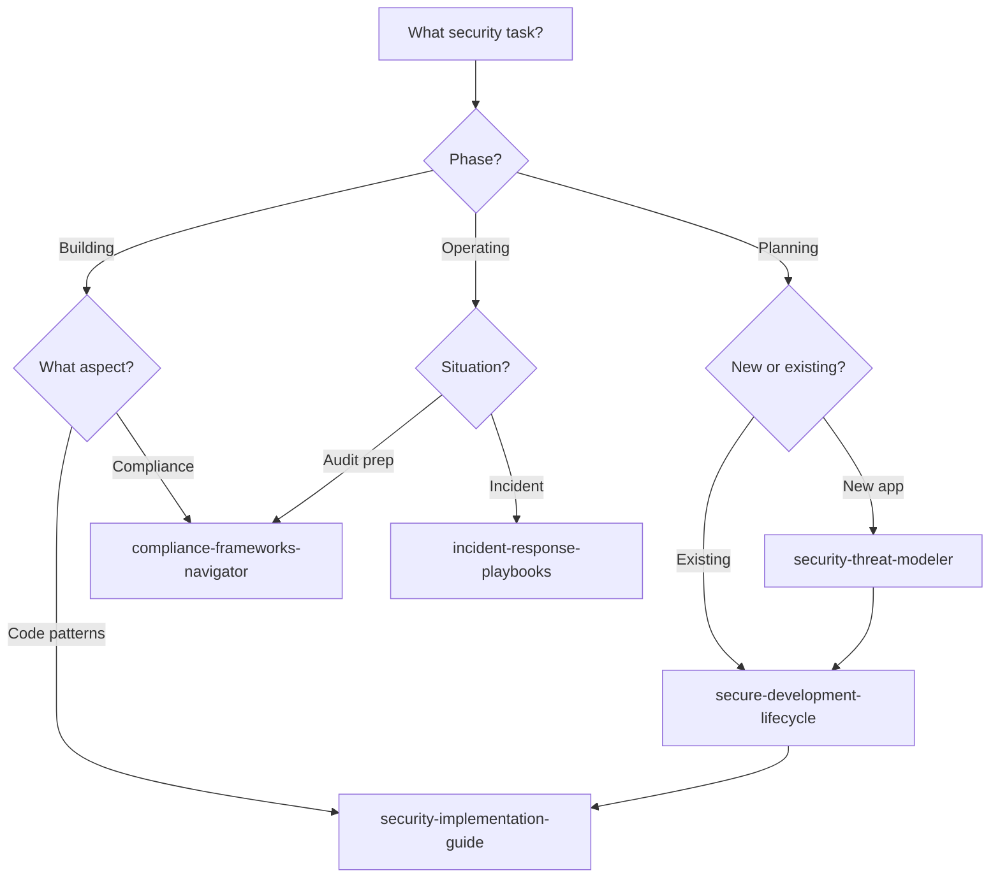

# Security & Compliance Ecosystem

This guide maps the relationships between security-focused skills in this repository and provides workflow guidance for using them together effectively.

## Skill Overview

| Skill | Category | Focus Area |
|-------|----------|------------|
| [`security-threat-modeler`](../../skills/security/security-threat-modeler/) | security | Threat identification & STRIDE analysis |
| [`security-implementation-guide`](../../skills/security/security-implementation-guide/) | security | Secure coding patterns |
| [`compliance-frameworks-navigator`](../../skills/security/compliance-frameworks-navigator/) | security | SOC 2, GDPR, HIPAA compliance |
| [`incident-response-playbooks`](../../skills/security/incident-response-playbooks/) | security | Security incident handling |
| [`secure-development-lifecycle`](../../skills/security/secure-development-lifecycle/) | security | SDL integration |

## Ecosystem Diagram



## Workflow Scenarios

### Scenario 1: New Application Security Assessment

**Goal:** Establish security posture for a new application from design to deployment.



**Skill Sequence:**
1. **`security-threat-modeler`** - Identify threats and attack surfaces
2. **`secure-development-lifecycle`** - Define security gates in SDLC
3. **`security-implementation-guide`** - Implement secure patterns
4. **`compliance-frameworks-navigator`** - Map to regulatory requirements

### Scenario 2: Compliance Audit Preparation

**Goal:** Prepare for a SOC 2 or GDPR compliance audit.



**Skill Sequence:**
1. **`compliance-frameworks-navigator`** - Map requirements to controls
2. **`security-implementation-guide`** - Verify secure implementations
3. **`security-threat-modeler`** - Document risk assessments
4. **`incident-response-playbooks`** - Ensure procedures are documented

### Scenario 3: Security Incident Response

**Goal:** Handle a security incident from detection to post-mortem.



**Skill Sequence:**
1. **`incident-response-playbooks`** - Execute response procedures
2. **`security-threat-modeler`** - Update threat model with lessons learned
3. **`security-implementation-guide`** - Implement security fixes
4. **`secure-development-lifecycle`** - Add preventive measures to SDL

## Decision Tree: Which Security Skill?



## Cross-Reference Matrix

| When using... | Consider also... | Reason |
|---------------|------------------|--------|
| security-threat-modeler | secure-development-lifecycle | Embed findings in process |
| security-implementation-guide | compliance-frameworks-navigator | Implementation supports compliance |
| compliance-frameworks-navigator | incident-response-playbooks | Compliance requires IR procedures |
| incident-response-playbooks | security-threat-modeler | Update model post-incident |
| secure-development-lifecycle | security-implementation-guide | SDL gates need implementation patterns |

## Security Control Mapping

| Control Area | Primary Skill | Supporting Skills |
|--------------|---------------|-------------------|
| Authentication | security-implementation-guide | compliance-frameworks-navigator |
| Authorization | security-implementation-guide | secure-development-lifecycle |
| Input Validation | security-implementation-guide | security-threat-modeler |
| Encryption | security-implementation-guide | compliance-frameworks-navigator |
| Logging/Monitoring | incident-response-playbooks | compliance-frameworks-navigator |
| Incident Management | incident-response-playbooks | secure-development-lifecycle |

## Handoff Patterns

### From Threat Modeling to Implementation
```
security-threat-modeler → security-implementation-guide
├─ Pass: Threat matrix, attack surfaces
├─ Expect: Mitigations implemented
└─ Verify: Each threat has corresponding control
```

### From Implementation to Compliance
```
security-implementation-guide → compliance-frameworks-navigator
├─ Pass: Implemented controls
├─ Expect: Compliance mapping
└─ Verify: Evidence collected for audit
```

### From Incident to Prevention
```
incident-response-playbooks → security-threat-modeler
├─ Pass: Post-mortem findings
├─ Expect: Updated threat model
└─ Verify: New threats documented
```

## Integration Checklist

### Starting a Secure Project
- [ ] Create threat model with `security-threat-modeler`
- [ ] Define SDL with `secure-development-lifecycle`
- [ ] Identify compliance needs with `compliance-frameworks-navigator`
- [ ] Prepare IR playbooks with `incident-response-playbooks`

### Security Review
- [ ] Update threat model
- [ ] Review code with `security-implementation-guide` patterns
- [ ] Verify compliance mappings
- [ ] Test incident response procedures

### Post-Incident
- [ ] Execute playbook from `incident-response-playbooks`
- [ ] Update threat model
- [ ] Implement fixes with `security-implementation-guide`
- [ ] Update SDL gates
- [ ] Review compliance impact

## Framework-Specific Guidance

| Framework | Primary Skill | Key Considerations |
|-----------|---------------|-------------------|
| SOC 2 Type II | compliance-frameworks-navigator | Evidence collection, continuous monitoring |
| GDPR | compliance-frameworks-navigator | Data mapping, consent, breach notification |
| HIPAA | compliance-frameworks-navigator | PHI handling, audit controls |
| PCI DSS | compliance-frameworks-navigator | Cardholder data, network segmentation |
| OWASP Top 10 | security-implementation-guide | Web application security patterns |
