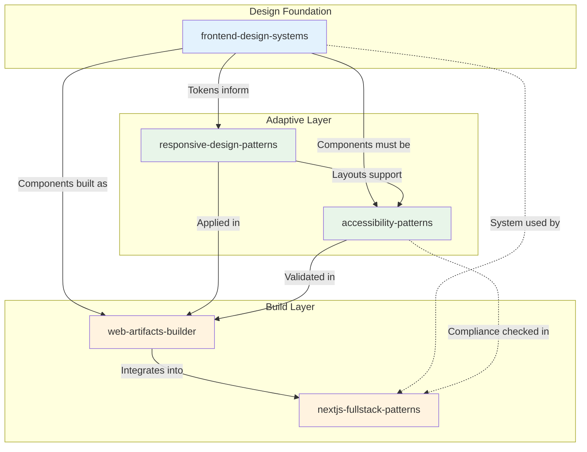
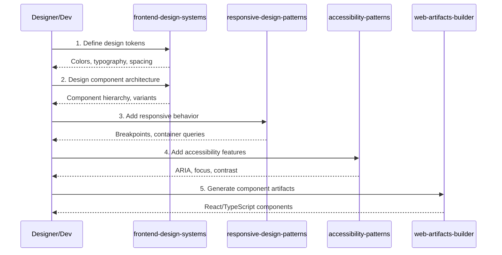
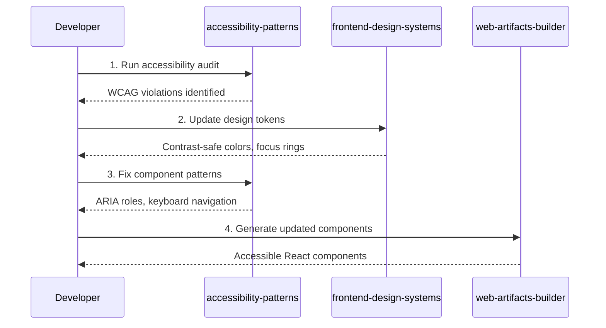
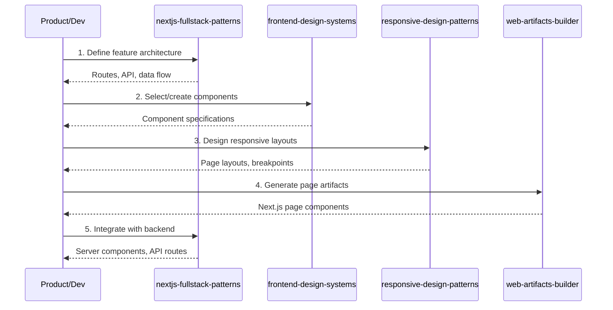
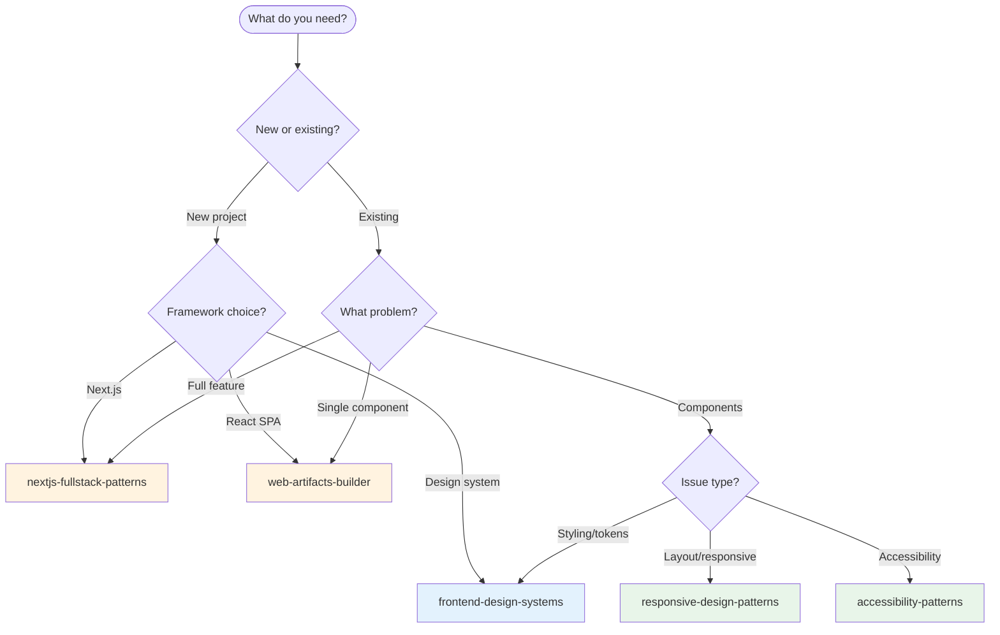

# Web Frontend Architecture Skills Ecosystem

This guide maps the relationships between web frontend-focused skills in this repository and provides workflow guidance for using them together effectively.

## Skill Overview

| Skill | Category | Focus Area |
|-------|----------|------------|
| [`frontend-design-systems`](../../skills/development/frontend-design-systems/) | development | Design tokens, component libraries |
| [`responsive-design-patterns`](../../skills/development/responsive-design-patterns/) | development | Adaptive layouts across viewports |
| [`accessibility-patterns`](../../skills/development/accessibility-patterns/) | development | WCAG compliance and inclusive design |
| [`web-artifacts-builder`](../../skills/development/web-artifacts-builder/) | development | React/TypeScript artifact generation |
| [`nextjs-fullstack-patterns`](../../skills/development/nextjs-fullstack-patterns/) | development | Full-stack Next.js applications |

## Ecosystem Diagram

## Workflow Scenarios

### Scenario 1: New Component Library

**Goal:** Create a design system with responsive, accessible components.

**Skill Sequence:**
1. **`frontend-design-systems`** - Define tokens and component structure
2. **`responsive-design-patterns`** - Add breakpoint and layout logic
3. **`accessibility-patterns`** - Ensure WCAG compliance
4. **`web-artifacts-builder`** - Generate production components

### Scenario 2: Accessibility Audit

**Goal:** Audit and remediate accessibility issues in existing components.

**Skill Sequence:**
1. **`accessibility-patterns`** - Identify accessibility violations
2. **`frontend-design-systems`** - Update tokens for compliance
3. **`accessibility-patterns`** - Apply fixes to component patterns
4. **`web-artifacts-builder`** - Regenerate compliant components

### Scenario 3: Full-Stack Feature

**Goal:** Build a complete feature with Next.js and design system integration.

**Skill Sequence:**
1. **`nextjs-fullstack-patterns`** - Plan feature architecture
2. **`frontend-design-systems`** - Define component requirements
3. **`responsive-design-patterns`** - Design adaptive layouts
4. **`web-artifacts-builder`** - Generate React components
5. **`nextjs-fullstack-patterns`** - Integrate into Next.js

## Decision Tree: Which Skill to Use?

## Cross-Reference Matrix

This matrix shows when each skill might invoke or reference another:

| Primary Skill | Invokes | For |
|---------------|---------|-----|
| `frontend-design-systems` | `accessibility-patterns` | Ensuring token contrast ratios |
| `frontend-design-systems` | `responsive-design-patterns` | Token breakpoint definitions |
| `responsive-design-patterns` | `frontend-design-systems` | Using spacing/sizing tokens |
| `responsive-design-patterns` | `accessibility-patterns` | Zoom/reflow compliance |
| `accessibility-patterns` | `frontend-design-systems` | Focus states, color contrast |
| `accessibility-patterns` | `responsive-design-patterns` | Reflow at 400% zoom |
| `web-artifacts-builder` | `frontend-design-systems` | Component specifications |
| `web-artifacts-builder` | `accessibility-patterns` | ARIA implementation |
| `nextjs-fullstack-patterns` | `frontend-design-systems` | Design system integration |
| `nextjs-fullstack-patterns` | `web-artifacts-builder` | Component generation |

## Common Handoff Patterns

### Design Systems → Responsive Patterns
When tokens are defined, inform responsive design:
- Spacing tokens for layout calculations
- Breakpoint values for media queries
- Container query thresholds

### Design Systems → Accessibility Patterns
Every component needs accessibility review:
- Color contrast verification
- Focus state design
- Interactive element requirements

### Responsive + Accessibility → Web Artifacts
Before generating components, combine concerns:
- Responsive props and breakpoints
- ARIA attributes and keyboard handling
- Combined into artifact specifications

### Web Artifacts → Next.js Patterns
For full-stack integration:
- Page component structure
- Data fetching patterns
- Server/client component boundaries

## Best Practices

### Sequential vs. Parallel Usage
- **Sequential:** New design system (tokens → responsive → accessible → build)
- **Parallel:** Responsive + accessibility can often be addressed together

### Avoiding Overlap
- **Design concerns:** `frontend-design-systems` owns tokens and component architecture
- **Layout concerns:** `responsive-design-patterns` owns breakpoints and adaptive layouts
- **Inclusion concerns:** `accessibility-patterns` owns WCAG compliance
- **Generation concerns:** `web-artifacts-builder` owns React component output
- **Integration concerns:** `nextjs-fullstack-patterns` owns Next.js architecture

### When to Combine Skills
Some tasks benefit from multiple skills in one session:
- **New feature:** design-systems + responsive + accessibility + artifacts
- **Accessibility remediation:** accessibility + design-systems (tokens)
- **Full-stack feature:** nextjs + design-systems + artifacts

## Related Resources

- [Creating Skills Guide](./creating-skills.md)
- [Skill Specification](../api/skill-spec.md)
- [Getting Started](./getting-started.md)
